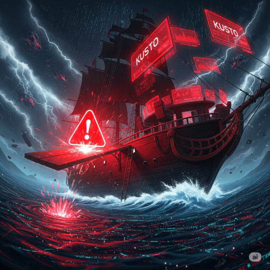

  
▶

  

    
Welcome To The Jungle

    
0:00 / 0:00

  

<iframe 
  id="yt-audio-iframe"
  width="0" height="0"
  src="https://www.youtube.com/embed/0CNPR2qNzxk?enablejsapi=1&controls=0&modestbranding=1&rel=0"
  allow="autoplay; encrypted-media">
</iframe>

# Who Am I
Hey there! I'm José Suárez, a Computer Systems Engineer with **+1 year** of experience in Cybersecurity. Actions speak louder than words, take a look below!

# Projects

## 40:2 Labs
<table>
  <tbody>
    <tr>
      <td></td>
      <td>40:2 Labs is an initiative to build and document cybersecurity environments from the ground up. Each lab focuses on deploying defensive infrastructure to simulate real-world security operations.</td>
    </tr>
  </tbody>
</table>

👉 [May enter this land, that is protected by polished labs](projects/40-2-labs/index.md)

## Diggy Diggy SOC
<table>
  <tbody>
    <tr>
      <td></td>
      <td>Diggy Diggy SOC is a series of walkthroughs focused on analyzing and resolving Security Operations Center (SOC) incidents from platforms like LetsDefend, TryHackMe and Hack The Box.</td>
    </tr>
  </tbody>
</table>

👉 [Face them on the SIEM, you will meet the logs](#)

## KQLhauled
<table>
  <tbody>
    <tr>
      <td></td>
      <td>KQLhauled is a KC7-based journey that solves cybersecurity challenges using Kusto Query Language (KQL) to investigate simulated incidents and uncover malicious activity from raw data.</td>
    </tr>
  </tbody>
</table>

👉 [Make that alert walk the plank, with a bottle of queries](#)

* * *
_**Inspired by [Hacker Theme](https://github.com/pages-themes/hacker)**_