# You Give HR A Bad PDF

## Description
Established a home lab environment utilizing VMware to simulate an attack scenario between Windows and Kali Linux VMs. This setup shows scripts usage within Metasploit and real-time event monitoring through Sysmon and Splunk.

## Prerequisites

### VMware Workstation Pro Setup
VMware Workstation Pro is a type 2 hypervisor which serves to isolate and create a dedicated communication channel between the lab environments. The installation is as follows:

1. Download VMware Workstation Pro, that is hosted at: [https://www.vmware.com/products/desktop-hypervisor/workstation-and-fusion](https://www.vmware.com/products/desktop-hypervisor/workstation-and-fusion).

2. Verify the executable's integrity through the File Checksums. In this case, the SHA-256 and MD5 checksums are found at the installer page.
    
3. Open a PowerShell terminal within the same download's location and execute:
    ```powershell
    Get-FileHash <file-name>
    ```

    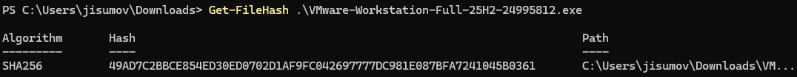{: .popup-img }

    Therefore, the hash can be matched with the provided list.

    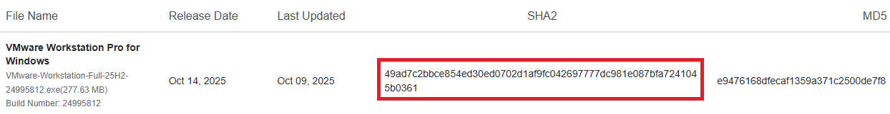{: .popup-img }

4. Proceed with the installation of VMware Workstation Pro by accepting the `End-User License Agreement`.

    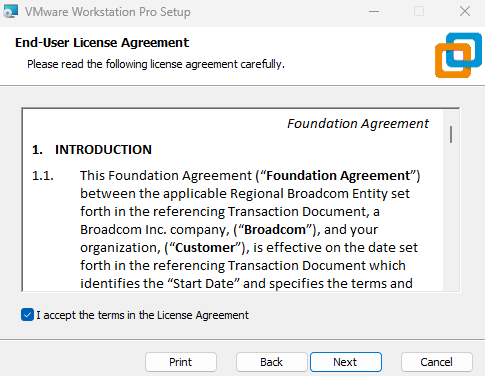{: .popup-img }

5. There is a compatible setup, referring to Hyper-V or Device/Credential Guard being enabled. 

    Hence, the virtual machines will be launched using the Windows Hypervisor Platform (WHP).

    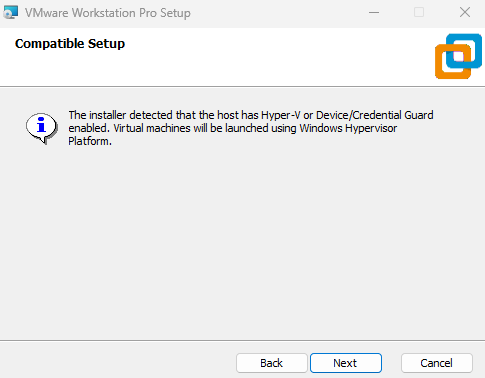{: .popup-img }

6. After setting the installation folder, tick the box `Check for product updates on startup`, to always ensure an up-to-date app version and mitigate risks like VM Escape. 

    Also, joining the `VMware Customer Experience Improvement Program` is optional.

    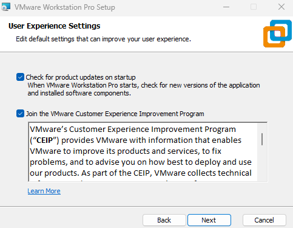{: .popup-img }

7. Finally, choose whether to create the shortcuts, then click `Install`. The VMware Workstation Pro interface should look like this:

    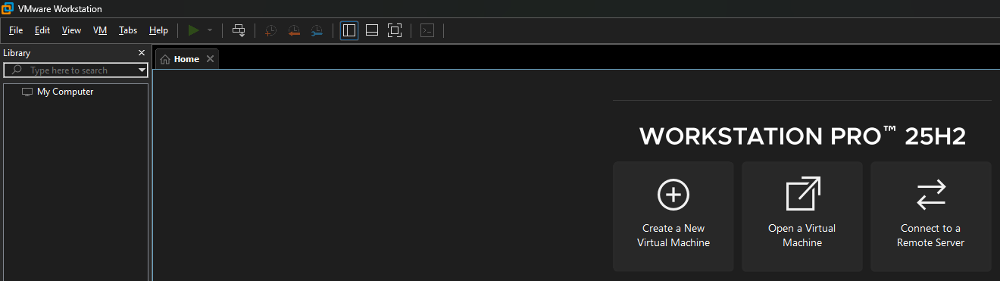{: .popup-img }

### Windows Setup
Windows 11 is the most recent Operating System developed by Microsoft. This is the host machine which will be targeted by Kali Linux.

1. Download the Windows Installation Media found at: [https://www.microsoft.com/en-us/software-download/windows11](https://www.microsoft.com/en-us/software-download/windows11).

2. During the install process, at the `Choose which media to use` section, select `ISO file`.

    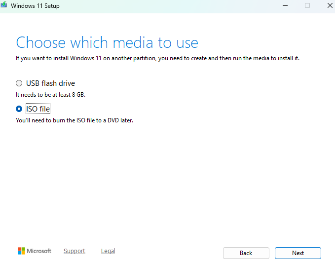{: .popup-img }

3. In VMware, click on `Create a New Virtual Machine`, then the `Typical` configuration and load the `Windows.iso` image.

    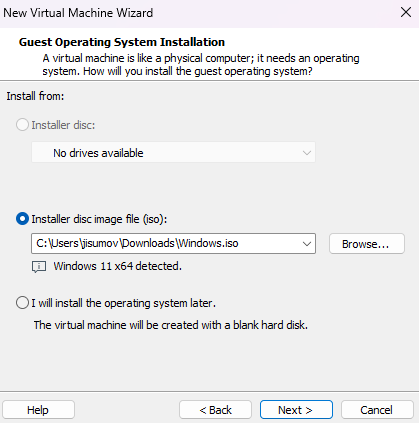{: .popup-img }

4. At the `Encryption Information` section, choose to encrypt all the files and set a password that you store in a safe place, such a password manager, in the host machine.

    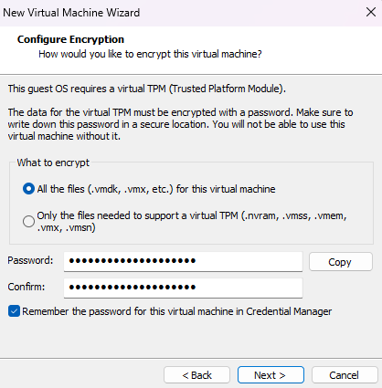{: .popup-img }

    Also, select `Store virtual disk as a single file` in the Specify Disk Capacity section.

    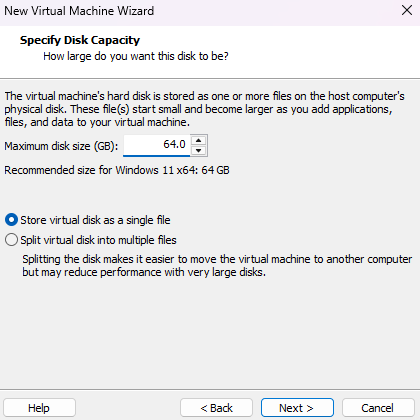{: .popup-img }

    **Note:** By default, the 64 GB of storage is not pre-allocated.

5. The summary will show the recommended hardware settings, except for one which must be configured manually, then click on `Customize Hardware...`

    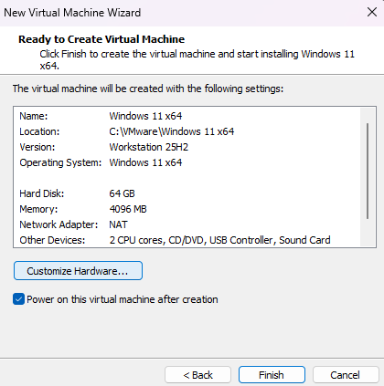{: .popup-img }

    The network adapter is set as `NAT` to share the host's internet connection, and so it will eventually require a Windows Account. Therefore, select `Host-only`, which will be helpful to bypass the remaining setup.

    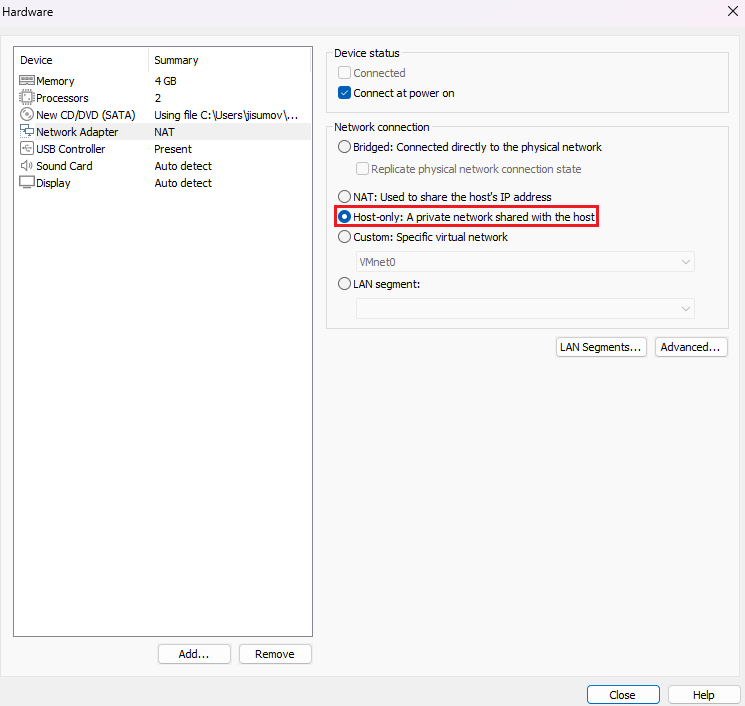{: .popup-img }

6. Finish the machine creation and click on `Power on this virtual machine`.

7. During the configuration process, make sure to select `I don't have a product key`.

    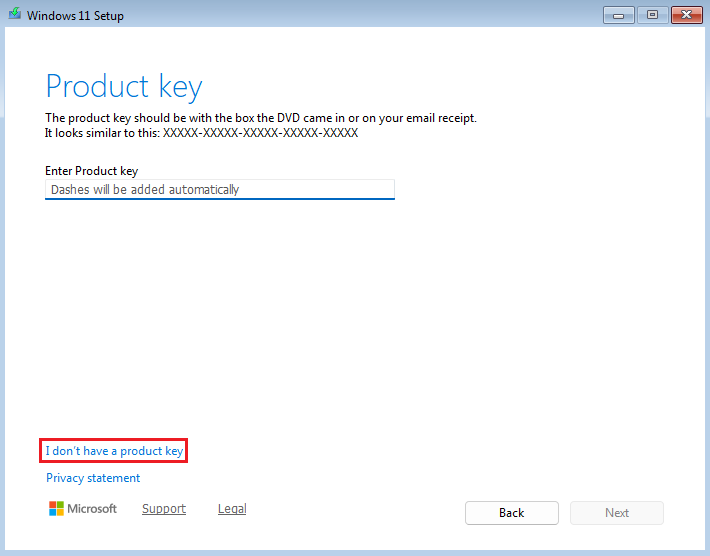{: .popup-img }

    In addition, select Windows 11 Pro, because of the `RDP` feature explained here: [https://learn.microsoft.com/en-us/windows-server/remote/remote-desktop-services/clients/remote-desktop-supported-config](https://learn.microsoft.com/en-us/windows-server/remote/remote-desktop-services/clients/remote-desktop-supported-config).

    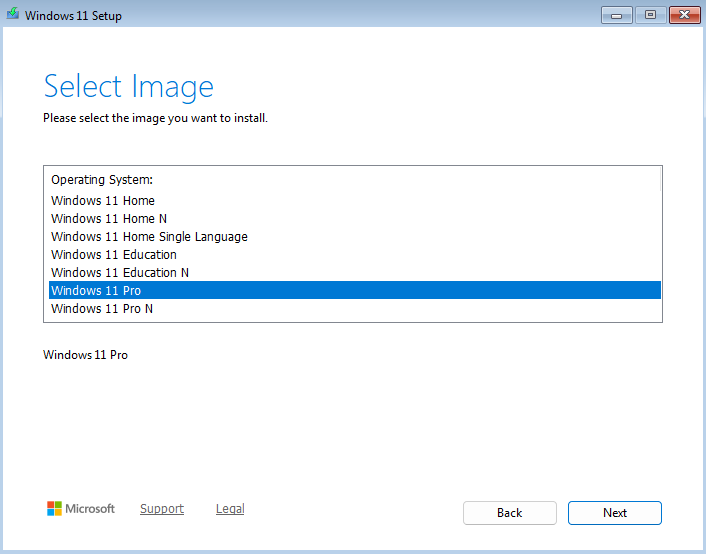{: .popup-img }

8. During the setup, it will ask to connect to a network. To bypass this step, do `Shift+F10` to open the `CMD` and execute the following command:

    ```powershell
    oobe\bypassnro
    ```

    It will restart the machine and enable the `I don't have internet` option, select it and finish the setup.

    {: .popup-img }

9. After the Windows setup, ensure a smoother virtualization experience by going to the `VM` tab and select `Install VMware Tools`.

    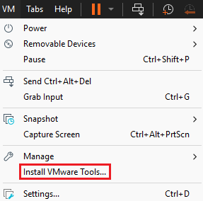{: .popup-img }

    It will load the drive and ask to execute the `Run setup64.exe`, click on it and follow the default options.

    {: .popup-img }

10. To have internet in the VM, go to the left bar, right click on the machine name and select `Settings...`

    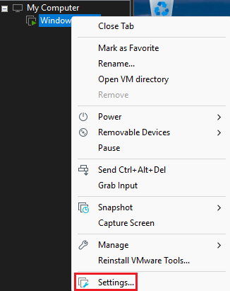{: .popup-img }

    And, in the `Network Adapter` section choose `NAT` to ensure the VM is not alongside the host network, but has its own through the host `IP`.

    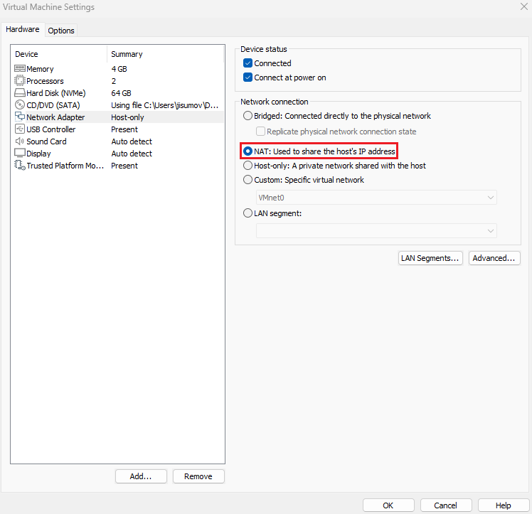{: .popup-img }

11. Finally, for future recovery of the fresh install, go to the `VM` tab, then click on `Snapshot` and `Take Snapshot...`

    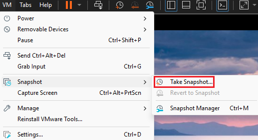{: .popup-img }

    Assign a name like "Fresh Install" and click `Take Snapshot`

    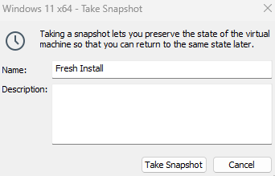{: .popup-img }

### Sysmon Setup
Sysmon is a service that monitors and logs system activity. This tool will be working on the Windows VM.

1. In the local machine, go to: [https://learn.microsoft.com/en-us/sysinternals/downloads/sysmon](https://learn.microsoft.com/en-us/sysinternals/downloads/sysmon). Then, click on `Download Sysmon`

    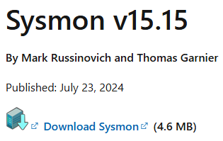{: .popup-img }

2. Sysmon can be installed with a configuration file. The balanced approach is found at: [https://raw.githubusercontent.com/olafhartong/sysmon-modular/master/sysmonconfig.xml](https://raw.githubusercontent.com/olafhartong/sysmon-modular/master/sysmonconfig.xml). Right click and select `Save as`, then keep it on a memorable location.

    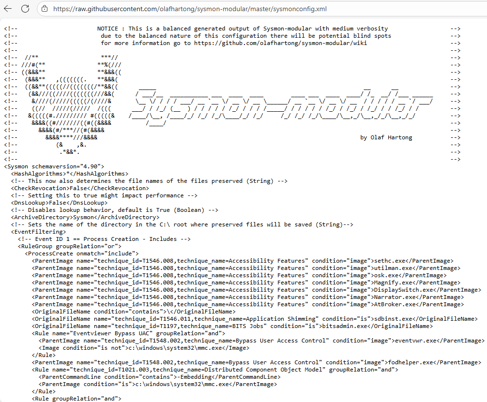{: .popup-img }

3. Open the `Downloads` folder and extract the `Sysmon.zip` as follows:

    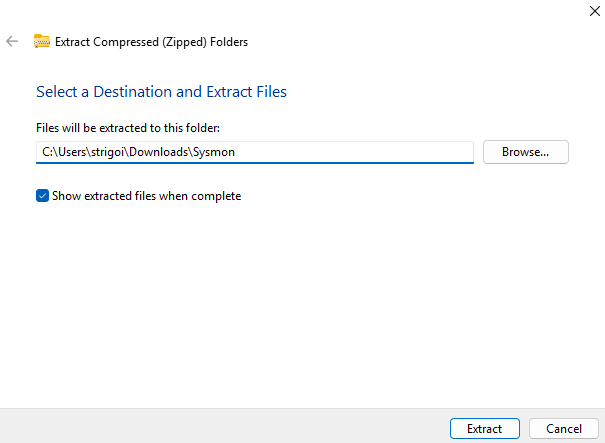{: .popup-img }

    Then, drag and drop the `sysmonconfig.xml` into the generated `sysmon` folder. The content should look like this:

    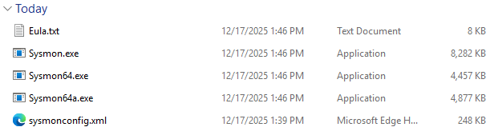{: .popup-img }

4. Open a PowerShell as an administrator within the same folder location and execute the following command to install Sysmon with the configuration file:

    ```powershell
    .\Sysmon64.exe -i .\sysmonconfig.xml
    ```

    Then, proceed with the default installation process.

    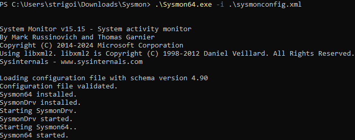{: .popup-img }

5. To check if Sysmon is up and running, press the Windows button to search `Services`, open it and then look for `Sysmon64`.

    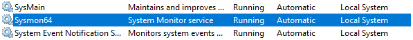{: .popup-img }

    Also, at the `Event Viewer`, Sysmon can be found via `Applications and Services Logs` -> `Microsoft` -> `Windows` -> `Sysmon`.

    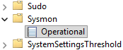{: .popup-img }

### Splunk Setup
Splunk is a Security Information and Event Management (SIEM) tool for searching, monitoring and analyzing machines' data. This solution will be working on the Windows VM.

1. In the local machine go to: [https://www.splunk.com/en_us/download/splunk-enterprise.html](https://www.splunk.com/en_us/download/splunk-enterprise.html). It requires an account to try the tool for 60 days.
    
    In this case, you may use a temporary email with: [https://temp-mail.org/](https://temp-mail.org/), which could serve as a workaround everytime Splunk is tested out.

    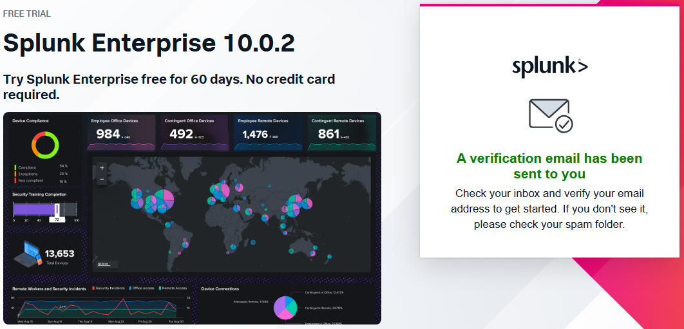{: .popup-img }

2. Now, click on `Download Now` to get the Splunk installer.

    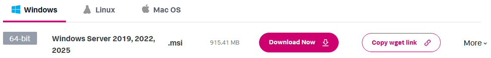{: .popup-img }

    Also, the integrity of the executable can be checked in the same way as the third step of the VMware Setup. Retrieve the hash by clicking on `More` and then on `Download SHA512 to verify your bits`.

    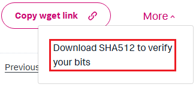{: .popup-img }

    It will download a file which can be opened with Notepad, and since the hash algorithm is SHA512, specify that in the PowerShell as follows:

    ```powershell
    Get-FileHash <file-name> -Algorithm SHA512
    ```

    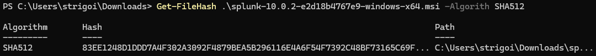{: .popup-img }

3. Execute the Splunk installer and follow the default settings. It will setup Splunk in a `Local System Account`, which is the Windows VM. 

    In case, Splunk needs to oversee data across multiple machines within an Active Directory domain, change to `Domain Account`.

    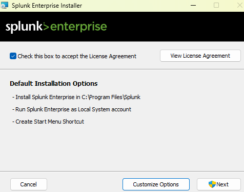{: .popup-img }

4. Splunk is now installed and running on `http://127.0.0.1:8000/`

5. In order to log the system events data, below the `Common tasks` tab, click on `Add data`.

    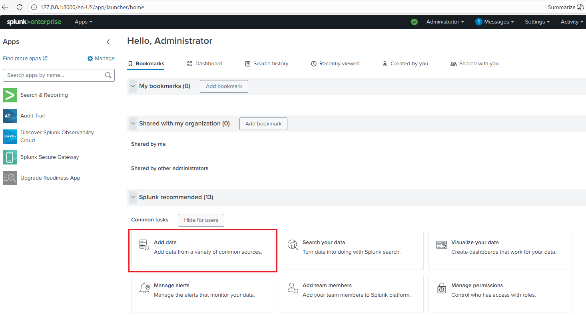{: .popup-img }

    Then, click on `Monitor`.

    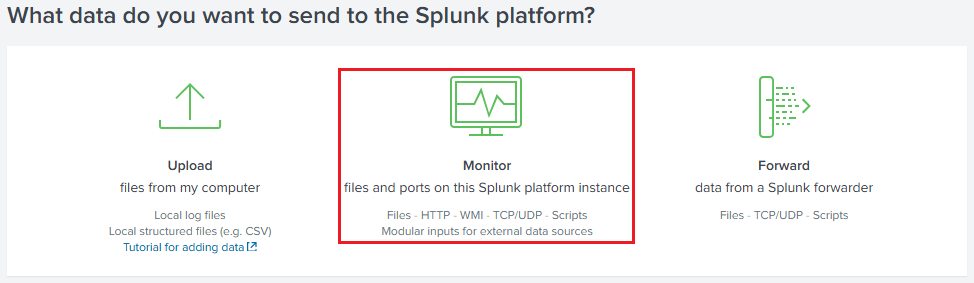{: .popup-img }
    
    Select `Local Event Logs` and choose `Application`, `Security` and `System`, which are standard for monitoring endpoints.

    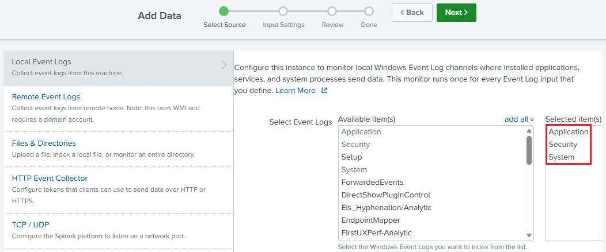{: .popup-img }

    Leave the default host value and click on `Create a new index`.

    {: .popup-img }
    
    The index can be called `endpoint`, which will be the Windows host's searchable repository for ingested data.

    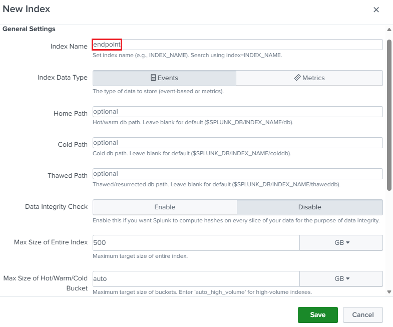{: .popup-img }

    The Input Settings should look like the following.

    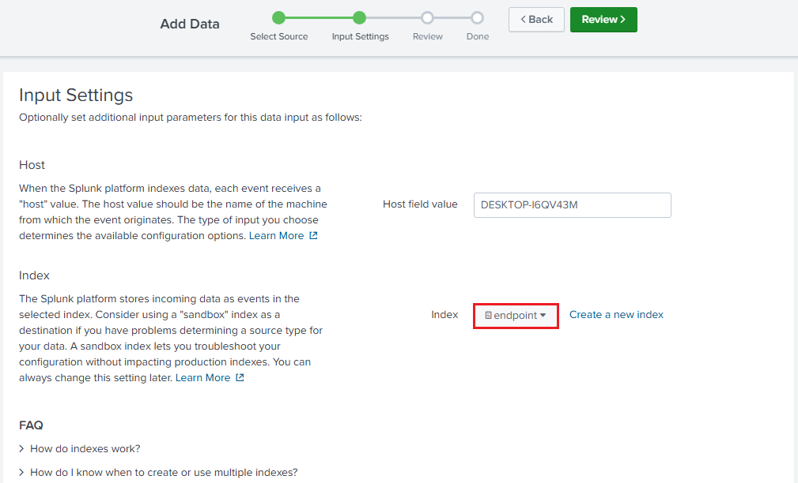{: .popup-img }

    After that, click on `Review` and then on `Submit`.

    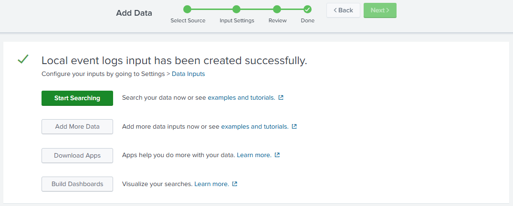{: .popup-img }

    Now, the logs can be retrieved by querying the endpoint index, for example:

     ```powershell
    source="WinEventLog:*" host="DESKTOP-I6QV43M" index="endpoint"
    ```

    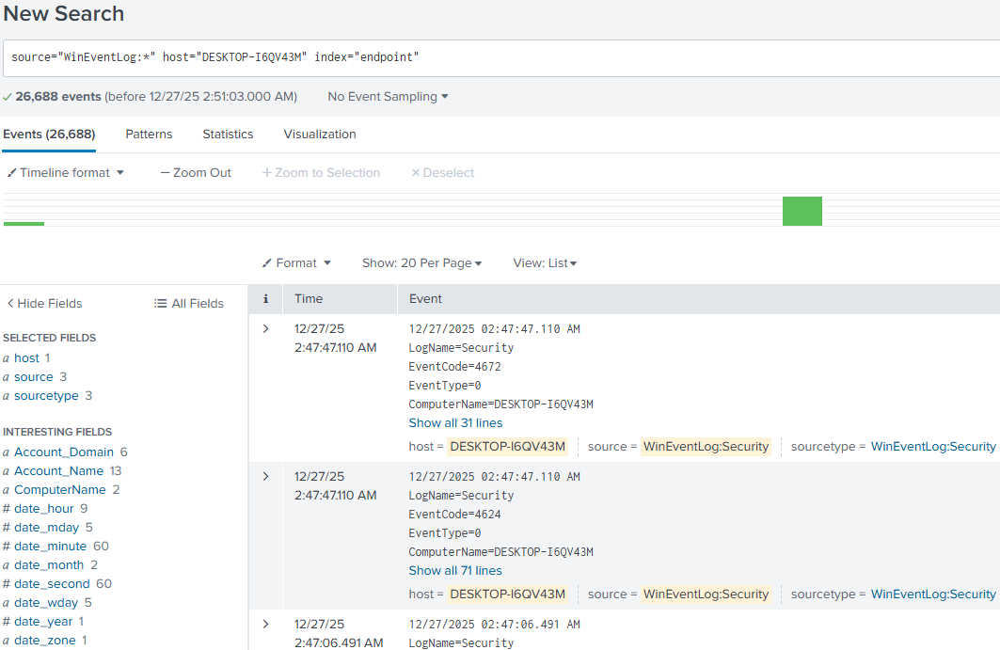{: .popup-img }

6. Install the `Splunk Add-on for Sysmon` by going to `Apps` -> `Find More Apps`.

    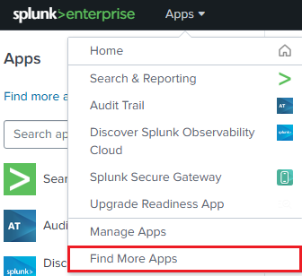{: .popup-img }

    Then, look for `Sysmon` -> Click on `Install`.

    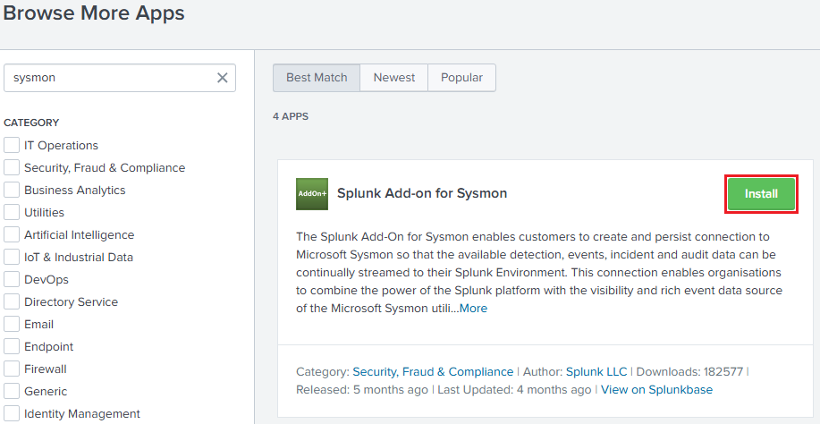{: .popup-img }

7. To ensure that Sysmon logs are ingested into Splunk, go to `C:\Program Files\Splunk\etc\system\local`, and look for the file `inputs.conf`

    If the file is not present, then go back to `system` folder, click on the `default` folder, and copy the `inputs.conf` file into the `local` folder, as shown in the following image.

    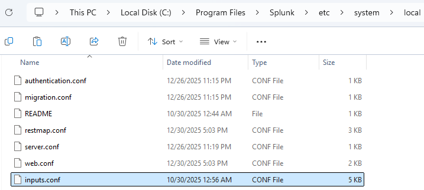{: .popup-img }

    Now, open the `inputs.conf` file, go to the bottom and paste the following configuration:
    
    ```
    [WinEventLog://Microsoft-Windows-Sysmon/Operational]
    index = endpoint
    disabled = false
    renderXml = true
    source = XmlWinEventLog:Microsoft-Windows-Sysmon/Operational

    [WinEventLog://Microsoft-Windows-Windows Defender/Operational]
    index = endpoint
    disabled = false
    source = Microsoft-Windows-Windows Defender/Operational
    blacklist = 1000,1001,1002,1150,1151,2000

    [WinEventLog://Microsoft-Windows-PowerShell/Operational]
    index = endpoint
    disabled = false
    source = Microsoft-Windows-PowerShell/Operational
    blacklist = 4105,4106,40961,40962

    [WinEventLog://Application]
    index = endpoint
    disabled = false

    [WinEventLog://Security]
    index = endpoint
    disabled = false

    [WinEventLog://System]
    index = endpoint
    disabled = false
    ```

    There are blacklisted event IDs, which reduces the noise from routine scanning or operational information. The following are the details:

    - **Windows Defender:** Based on the [Official Microsoft Defender Documentation](https://learn.microsoft.com/en-us/defender-endpoint/troubleshoot-microsoft-defender-antivirus).

        - **1000**: An antimalware scan started.
        - **1001**: An antimalware scan finished.
        - **1002**: An antimalware scan was stopped before it finished.
        - **1150**: The antimalware platform is running and in a healthy state.
        - **1151**: Endpoint Protection client health report.
        - **2000**: The antimalware definitions updated successfully.

    - **Powershell:** Based on [S0cm0nkey’s Security Reference Guide](https://s0cm0nkey.gitbook.io/s0cm0nkeys-security-reference-guide/blue-defense/event-detection/detection-use-cases/windows-event-id-logging-list) and [MyEventLog](https://www.myeventlog.com/find).

        - **4105**: Script Block Execution start.
        - **4106**: Script Block Execution stop.
        - **40961**: PowerShell console is starting up.
        - **40962**: PowerShell console is ready for user input.
    
        **Note**: Event ID **4104** refers to Script Block Logging, which leverages the hunting of suspicious Powershell commands. This is a better approach than relying on events **4105** and **4106**, that may cause noisy logs. For further reference: [Malware Archeology](https://static1.squarespace.com/static/552092d5e4b0661088167e5c/t/5ba3dc87e79c703f9bfff29a/1537465479833/Windows+PowerShell+Logging+Cheat+Sheet+ver+Sept+2018+v2.2.pdf) and [Black Hills Information Security](https://www.blackhillsinfosec.com/powershell-logging-blue-team/).

    After setting the mentioned configuration, restart the `Splunkd Service`, as shown in the image below.

    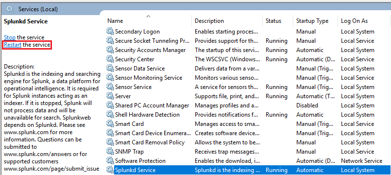{: .popup-img }