# Fortunate VPN

## Description
This Let's Defend's alert was triggered from the Rule Name `SOC257 - VPN Connection Detected from Unauthorized Country`, with Event ID **225**. Suspicious signin attempts from Vietnam, were they successful?

## Case Workflow

The case will be handled in accordance with the **NIST 800-61** Incident Response Framework. The following is an overview of the generated alert:

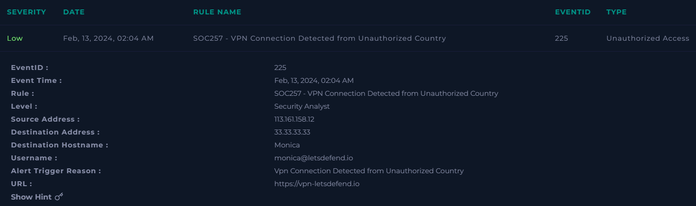{: .popup-img }

Some attributes to highlight are:

1. This is a `Low` severity alert of type `Unauthorized Access`
2. The event was generated on `02-13-2024 02:04:00 [UTC]`
3. The source address (VPN) is `113[.]161[.]158[.]12`
4. The affected user is `monica@letsdefend[.]io`
5. The attempted website is `hxxps[:]//vpn-letsdefend[.]io`

**Note:** Dates follow the US format, and timestamps are presented in UTC. Additionally, all indicators are defanged to prevent accidental interaction.

### Detection & Analysis

The detection occurred once the logs matched the rule `SOC257 - VPN Connection Detected from Unauthorized Country`. In this case, it may be due to the logon was performed from a non-standard business operations location, or due to the source IP is reported in Threat Intelligence feeds.

Now, the analysis may proceed based on the provided `playbook`

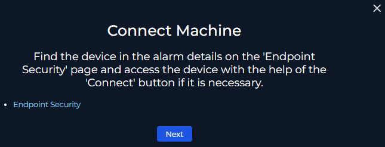{: .popup-img }

The machine is called `Monica`. Then, it can be searched in the **Endpoint Security** section as:

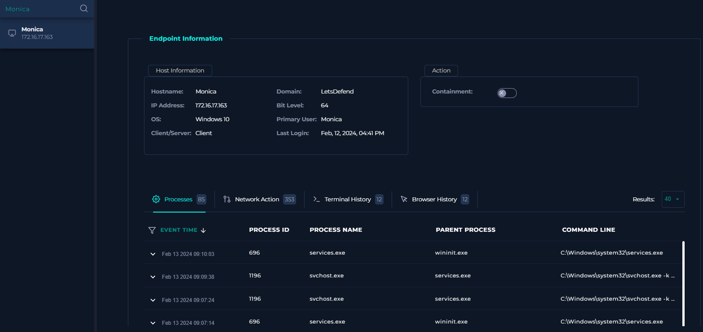{: .popup-img }

It turns out that the host is running Windows 10 and the private IP is `172[.]16[.]17[.]163`

Also, there are four telemetry categories: _Processes_, _Network Action_, _Terminal History_ and _Browser History._

- **Processes:** The logs do not suggest a suspicious behavior but normal system processes execution. Also, the earliest event occurred on `02-13-2024 05:25:00 [UTC]`, over 3 hours after the alert generation, which in a context of `near-real-time (NRT)` detection, should have spawned the alert at least around `05:25:00 [UTC]`

    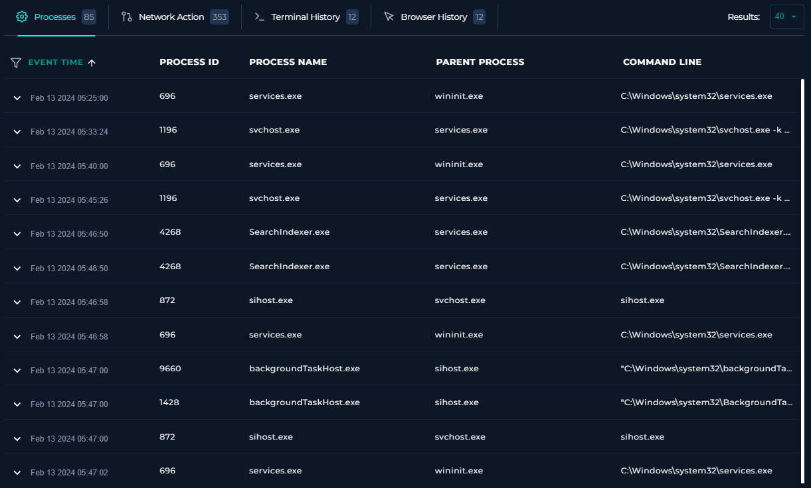{: .popup-img }

- **Network Action:** The list of IPs is overwhelming and may delay the investigation. However, the earliest event does not match the alert date, as the records are from `02-13-2024 05:20:29 [UTC]`, so this tab could be ignored in favor of a better IP lookup approach.

    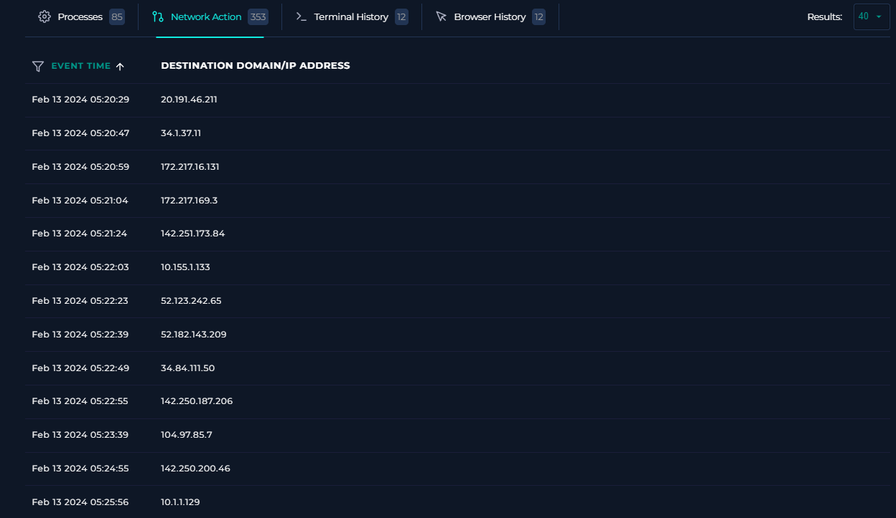{: .popup-img }

- **Terminal History:** The observed command-lines look suspicious, as they seem to be related to multiple techniques including `T1082 (System Information Discovery)`, `T1016 (System Network Configuration Discovery)` and `T1087 (Account Discovery)`

    Although, the timestamps are in a scheduled way, meaning that every 15 minutes a command-line is executed, this behavior is inconclusive. In some cases, these scheduled tasks may come from a legitimate administrative setup, or in the worst case scenario, there is an automated malware activity.

    In addition, the commands started their execution on `02-13-2024 08:00:00 [UTC]`, approximately 6 hours later from the alert timestamp.

    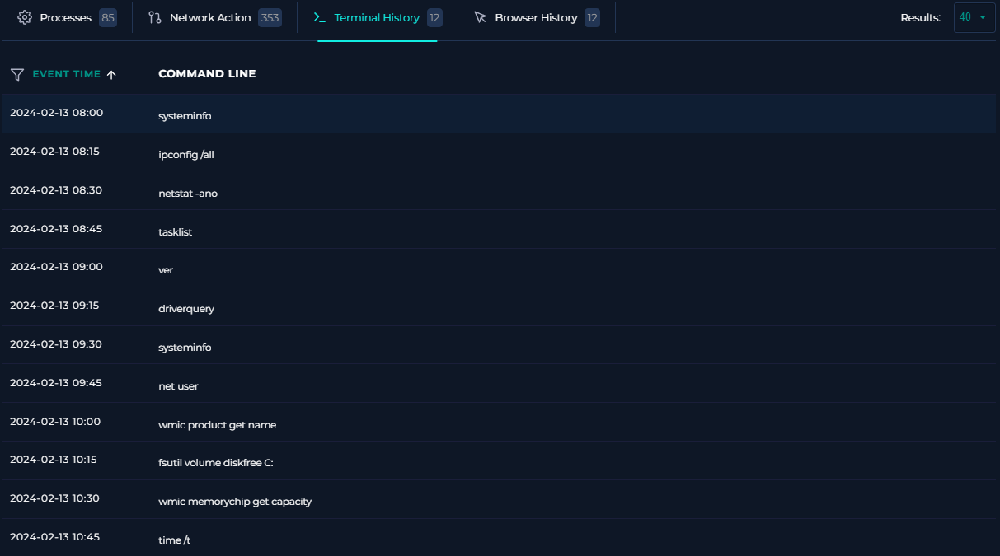{: .popup-img }

- **Browser History:** The visited URLs are benign and do not represent an anomalous behavior. However, if the user credentials were compromised, the source cannot be determined, as the user's browser history database does not retain incognito session activity, which could have been used for accessing a phishing website.

    One thing to note is the first timestamp on `02-13-2024 07:45:12 [UTC]`, which in a normal business environment coincides with the start of working hours. This leads to a scenario where the previous telemetry could correspond to expected automated system actions, for example in a Cloud PC, where the user could be disconnected, but the machine is still up and running.
    
    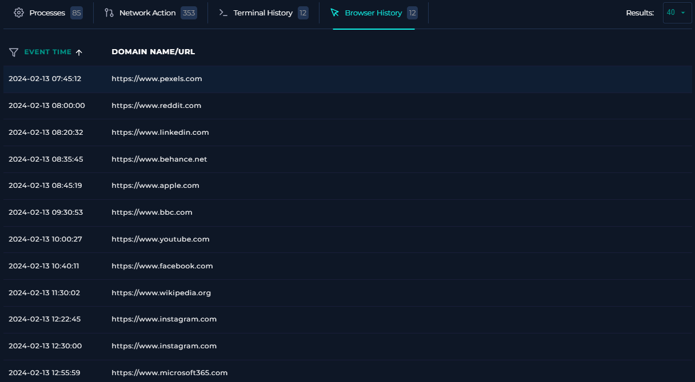{: .popup-img }

Going forward in the playbook, it suggests to verify the provided insights by **Tier 1**. But, there are not notes, so a deeper analysis should be carried on to give a verdict.

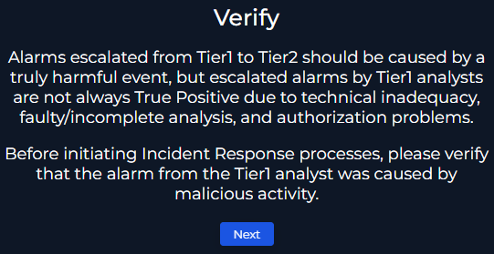{: .popup-img }

The source IP `113[.]161[.]158[.]12` reputation can be retrieved in the Let's Defend Threat Intelligence feed:

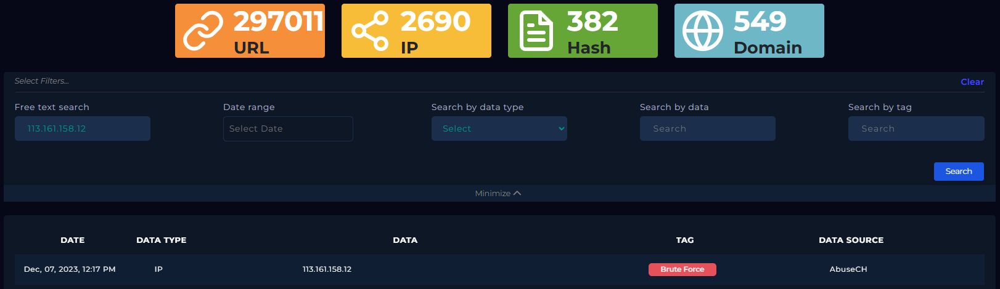{: .popup-img }

As shown in the results, the IP is flagged as `Brute Force` from the `AbuseCH` data source, a platform that tracks cyber threat signals.

Also, in `VirusTotal` the IP is reported as `Malicious` and `Phishing` by `9/94` data sources.

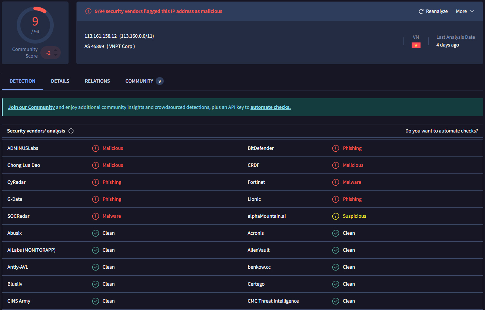{: .popup-img }

When looking in `AbuseIPDB` the IP was reported `4,656` times and it belongs to the Fixed Line ISP `Vietnam Posts and Telecommunications Group`

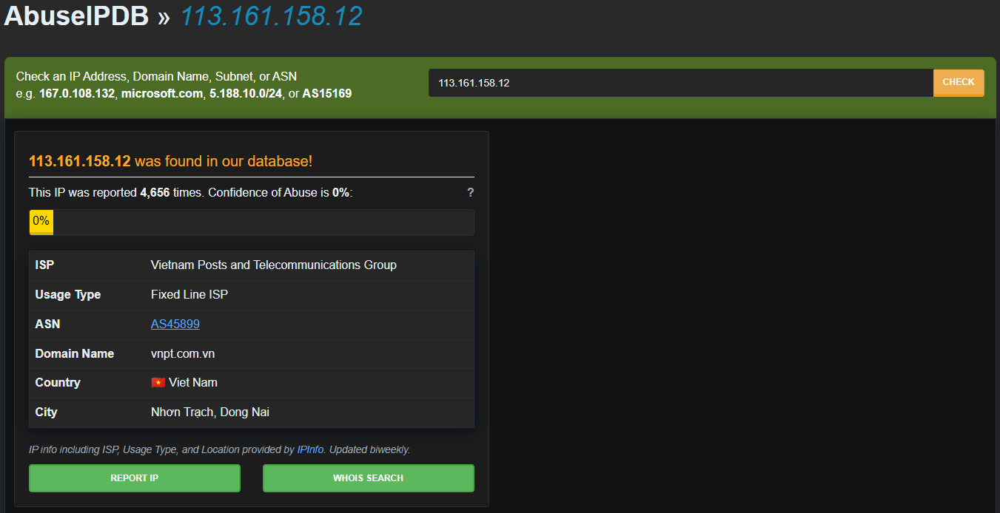{: .popup-img }

In Talos Intelligence, the web reputation is `Unstrusted` and the status of the block lists is `EXPIRED`, which means that in the past the IP was flagged as malicious, but currently it is not. 

This aligns with the recent `Confidence of Abuse` score of `0%` from AbuseIPDB, as the massive reports happened in a time were the IP was performing malicious actions.

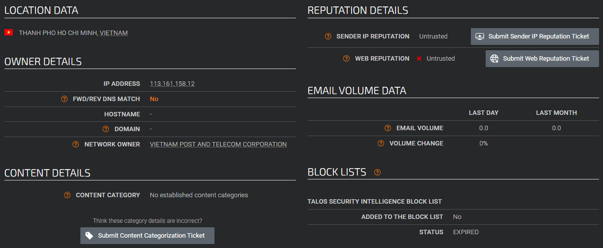{: .popup-img }

In `IP2Location` the Proxy Data suggests that the IP is `not an Anonymous Proxy`, which means that currently the IP is `not a VPN`

Finally, the location is `Hanoi, Vietnam`, then a question arises: **Is Monica actually trying to access her account from Vietnam?**

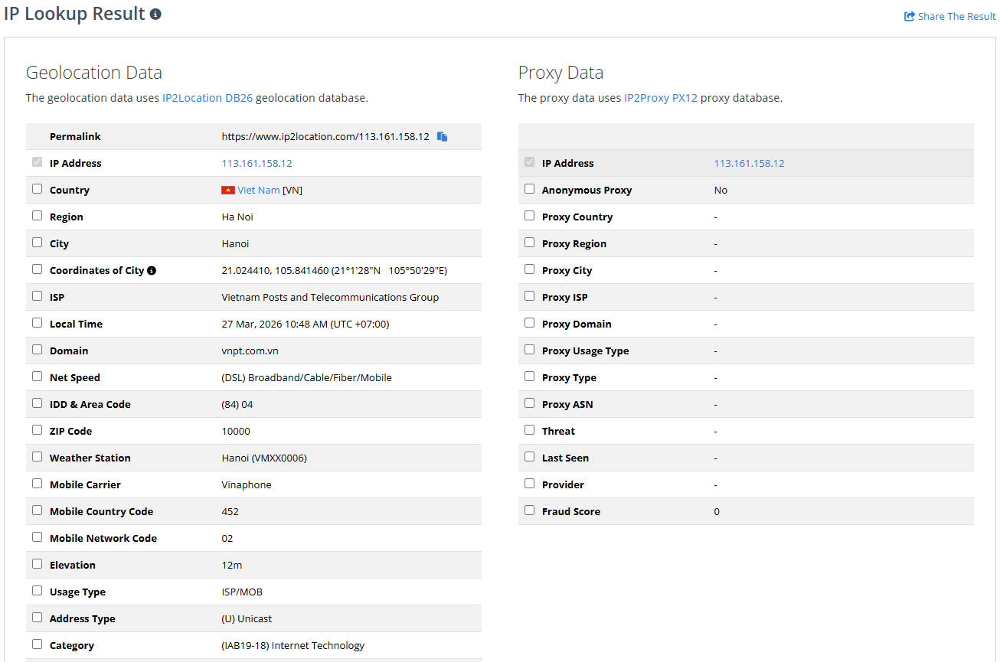{: .popup-img }

To answer that doubt, Monica could have requested to HR an exception for working abroad. In the `Email Security` section, there are 3 emails sent by `security@letsdefend[.]io` to `monica@letsdefend[.]io` regarding One-Time Password (OTP) for completing the Multi-Factor Authentication (MFA) activation process.

These emails were delivered on `02-13-2024`, between `02:01:00 [UTC]` and `02:03:00 [UTC]`

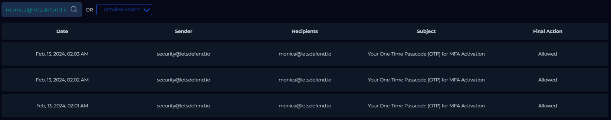{: .popup-img }

The emails' content describes the origin of the activity including the source `IP`, `OS`, `Browser`, `Location` and the Targeted `URL`. Also, the email states that **if Monica did not request to start the MFA activation process, she should contact the customer support immediately.**

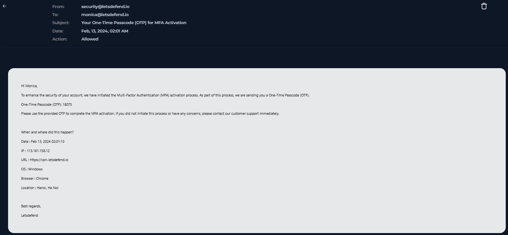{: .popup-img }

There is not any email related to Monica working abroad or that may explain the detected behavior. Then, the source IP `113[.]161[.]158[.]12` could be searched through various records in the `Log Management` section as follow:

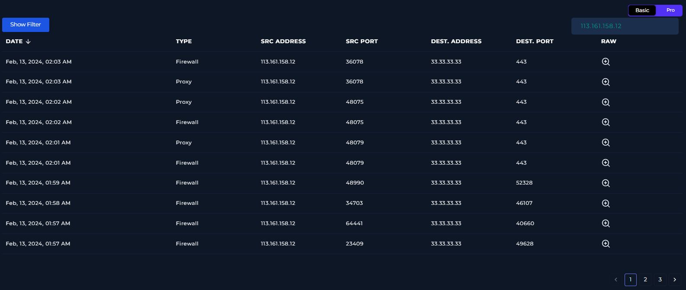{: .popup-img }

On `02-13-2024`, between `01:49:00 [UTC]` and `01:59:00 [UTC]` there were multiple Firewall events from IP `113[.]161[.]158[.]12` targeting the address `33[.]33[.]33[.]33` over different ports.

However, at `02:01:00 [UTC]`, the first OTP validation happened resulting in a `FAILED` state.

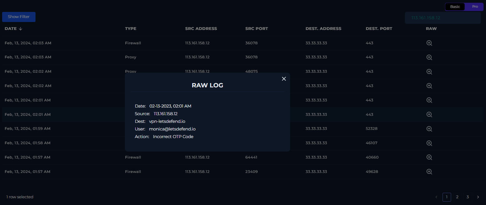{: .popup-img }

At `02:01:01 [UTC]`, there was a Proxy record referring to a `POST` request from the account `Monica@letsdefend[.]io` into the VPN URL `hxxps[:]//vpn-letsdefend[.]io/logon[.]html`, via the Protocol `HTTP/1.0`, returning a `200` status.

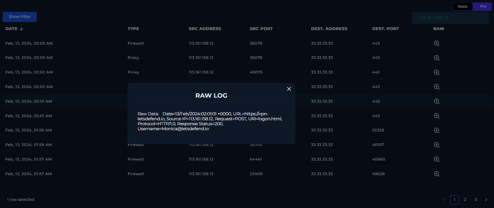{: .popup-img }

This is a login activity, which request was processed by the server (status 200), however **it does not mean that the login attempt was successful.**

There are 4 more logs with the same behavior about the `Incorrect OTP Code` message and the processed login attempts. Although, there is not any successful logon even if searching for `monica` as follow:

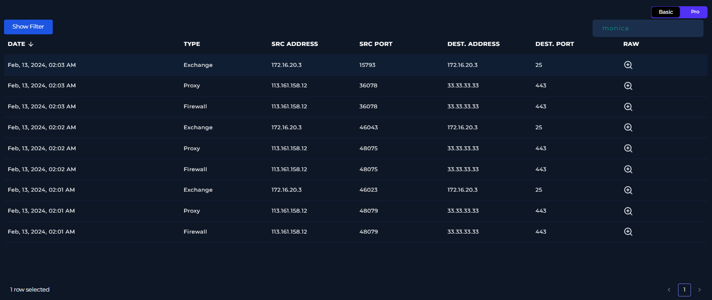{: .popup-img }

After reviewing all the indicators, we may proceed with the alert verdict, which is likely a `True Positive`, due to the source IP **reputation** and **geolocation**, as well as the **repeated failed OTP code validations** during **non-business hours.**

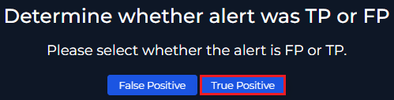{: .popup-img }

### Containment, Eradication & Recovery

Now, the playbook asks for the `Incident Type`, which is `Unauthorized Access`

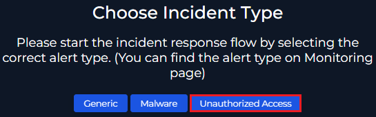{: .popup-img }

Later on, the threat actor is being requested to be defined. In this case, the behavior relates to `Multiple login failures to a computer system` and `Access to systems outside of normal business hours`

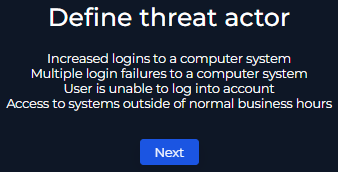{: .popup-img }

The identified source IP is `113[.]161[.]158[.]12`

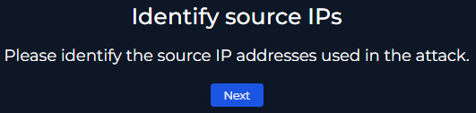{: .popup-img }

The IP belongs to the `External Network`

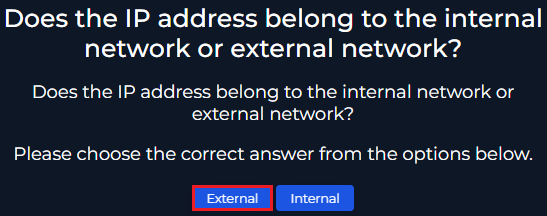{: .popup-img }

Based on multiple open threat intelligence sources, the IP reputation is `Malicious`

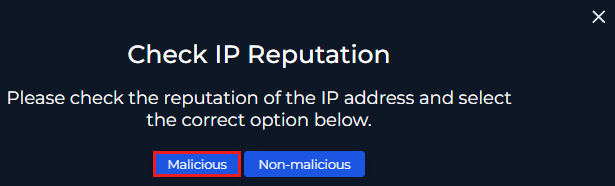{: .popup-img }

Among the possible impacted systems there are the Monica's workstation, which was not found affected, as well as the VPN application where the attacker attempted the logins, that were not successful.

Although, if the VPN service sent automated emails to Monica regarding OTP codes for starting the MFA activation, `it is likely that her first authentication method (password) was compromised`

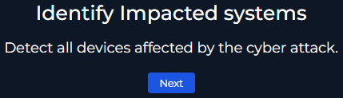{: .popup-img }

There were multiple destination ports for the targeted IP `33[.]33[.]33[.]33`. The most relevant is `443`, the default TCP port for HTTPS, where all login attempts took place with no success.

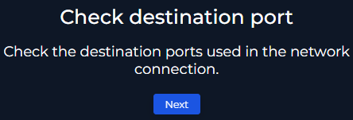{: .popup-img }

Furthermore, `there was not any impact on critical systems`

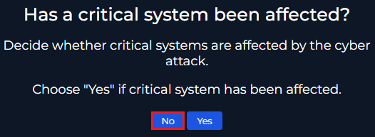{: .popup-img }

Additionally, `no sensitive data is at risk`

**Note:** Sensitive data is any data that could cause damage if exposed. As there was no intrusion, the potential sensitive data exfiltration risk was mitigated.

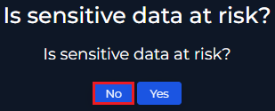{: .popup-img }

On the other hand, `the device did not require to be isolated`, as the threat actor could not get access to Monica's account for further infiltration.

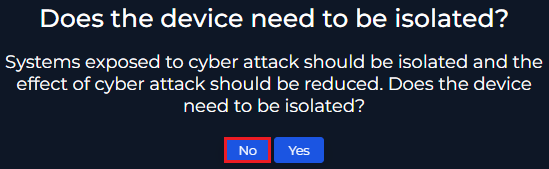{: .popup-img }

Now, among all the found evidence, the relevant indicators reside in the `network layer` and are registered in the SIEM, hence the records in the `Log Management` section should be enough for supporting the investigation.

If there is any Event ID that is not ingested into the SIEM, the `.evtx` files could be retrieved from a `Live Response Session` for further analysis. 

Also, the `Investigation Package` from a device could help to check any other suspicious autoruns, processes, scheduled tasks, etc. 

Please see more at: [https://learn.microsoft.com/en-us/defender-endpoint/respond-machine-alerts](https://learn.microsoft.com/en-us/defender-endpoint/respond-machine-alerts)

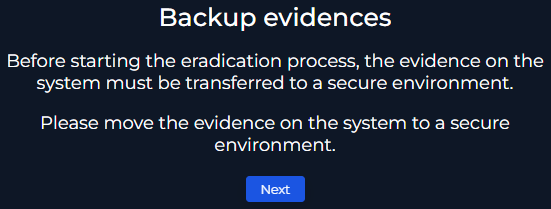{: .popup-img }

The eradication depends on the infrastructure capabilities. In this case, the platform is limited to device containment, which does not fit with the verdict.

However, `Monica's password should be reset and her sessions revoked`, as it seems that the threat actor gained access to the first authentication method.

Subsequently, `Monica and her manager should be informed about the incident` along with `clear instructions for recovering access to the account`

In addition, `the source IP 113[.]161[.]158[.]12 should be blocked at the Firewall level`, to prevent any other `dictionary` or `password spray` attacks.

**Note:** This step really depends on the organization's Standard Operating Procedures (SOPs).

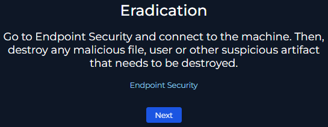{: .popup-img }

Finally, the recovery phase `could consist on the support given to Monica for recovering her account`, along with `continuous monitoring of the Firewall events` in case new suspicious IPs target the VPN application.

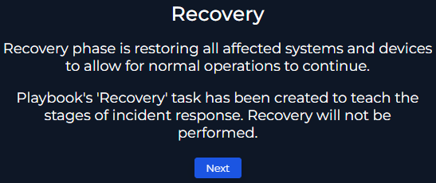{: .popup-img }

### Post-Incident Activity

Everytime a security event occurs, whether is a True Positive or False Positive, `it should be documented for future reference`

Therefore, the following questions will be answered briefly:

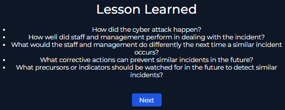{: .popup-img }

1. **How did the cyber attack happen?** The cyber attack came from a threat actor with source IP `113[.]161[.]158[.]12` attempting to authenticate in the VPN application as `monica@letsdefend[.]io`, resulting in the generation of 3 OTP codes. The attempts failed and it is likely that Monica had her first authentication method compromised.

2. **How well did staff and management perform in dealing with the incident?** The staff and management proceeded based on the `NIST 800-61 Incident Response Framework` to correctly address the issue. However, the lack of `SOPs` may delay investigations, as the scope is not defined or could rely on other teams' coordination.

3. **What should the staff and management do differently the next time a similar incident occurs?** The staff and management could setup the mentioned `SOPs`, which would improve analysts' decisions. Also, the `playbook` could be reviewed in terms of adding the `Indicators Of Compromise (IOCs)` in earlier stages, to mitigate impact across other assets while the investigation proceeds.

4. **What corrective actions can prevent similar incidents in the future?** The IT department could setup `Conditional Access Policies` to block any authentication attempt outside non-business hours or unauthorized countries, as the threat actor could have tricked Monica in providing the OTP code. Followed by `User Awareness Programs` to ensure employees stay tuned with the most common threats.

5. **What precursors or indicators should be watched for in the future to detect similar incidents?** As stated in the `Pyramid of Pain`, the best approach is to understand the `Tactics, Techniques and Procedures (TTPs)` that threat actors may utilize. For example, in [Campaign C0032](https://attack.mitre.org/campaigns/C0032) _TEMP.Veles_ used compromised VPN accounts during a chain of different techniques to infiltrate IT environments.

Also, other questions arise such as **how to ensure that the observed suspicious command-lines are benign** and **how to fix the Endpoint Detection and Response (EDR) Agent to enable Live Response capabilities**, which answers depend on the organization's established practices.

## Ticket Documentation

`Case:` SOC257

`What:` VPN Connection Detected from Unauthorized Country

`When:` 02-13-2024 02:04:00 [UTC]

`Who:` monica@letsdefend[.]io

`Why:` Because...

`Additional Notes:`

- bullet 1
- bullet 2

`Actions taken:`

- bullet 3
- bullet 4

`Verdict:` True Positive

## Lessons Learned