# Home Lab

## Description
Established a foundational home lab environment utilizing VMware to simulate a hypothetical attack scenario between 2 VMs: Kali Linux and Windows. This setup demonstrates essential hardening techniques, custom script implementation within Metasploit, and real-time incident monitoring through Splunk and Sysmon.

## Pre-requisites

### VMware Setup
VMware is a type 2 hypervisor which serves to isolate and create a dedicated communication channel between the lab environments. The installation is as follows:

1. Download the VMware Workstation Pro found at: [https://www.vmware.com/products/desktop-hypervisor/workstation-and-fusion](https://www.vmware.com/products/desktop-hypervisor/workstation-and-fusion).

2. Verify the executable's integrity through the File Checksums. In this case, the SHA-256 and MD5 checksums are found at the installer page.

3. Open a PowerShell terminal within the same download's location and execute:
    ```bash
    Get-FileHash <file-name>
    ```

    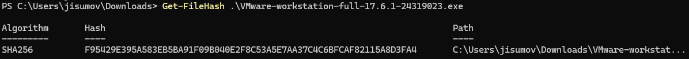

    Therefore, the hash can be matched with the provided list.

    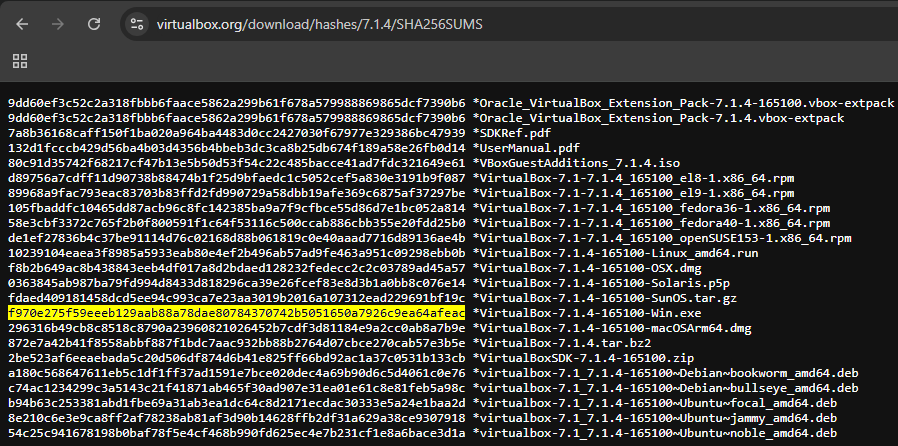

5. Install VMware and mark `Install Windows Hypervisor Platform (WHP) automatically` to avoid conflicts in virtualization when Hyper-V or Device/Credential Guard are enabled.

    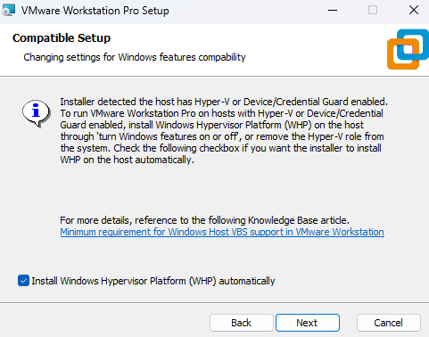

    In addition, select `Use VMware Workstation 17 for Personal Use` to execute VMware without a license.

    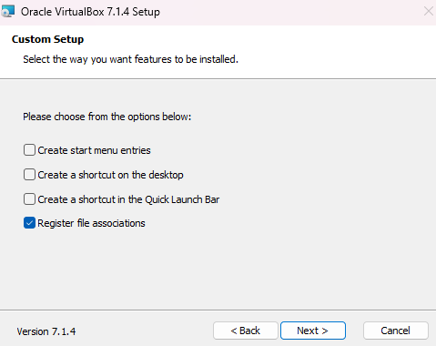

## Windows Setup
Windows 11 is the most recent Operating System developed by Microsoft. This is the host machine which will be targeted by Kali Linux.

1. Download the Windows Installation Media found at: [https://www.microsoft.com/en-us/software-download/windows11](https://www.microsoft.com/en-us/software-download/windows11).

2. During the install process, at the `Choose which media to use` section, select `ISO file`.

    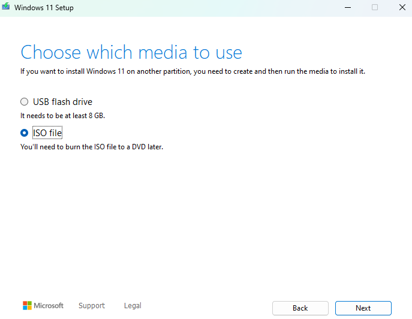

3. In VMware, click on `Create a New Virtual Machine`, then the `Typical` configuration and load the `Windows.iso` image.

    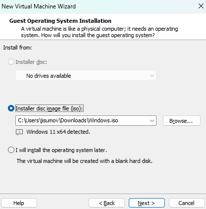

4. At the `Encryption Information` section, choose to encrypt all the files and set a password that you store in a safe place, such a password manager, in the host machine.

    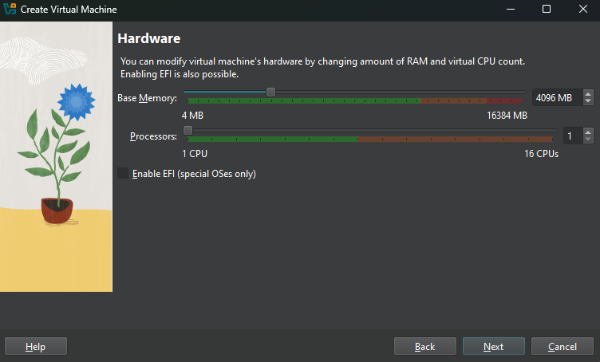

    Also, select `Store virtual disk as a single file` in the Specify Disk Capacity section.

    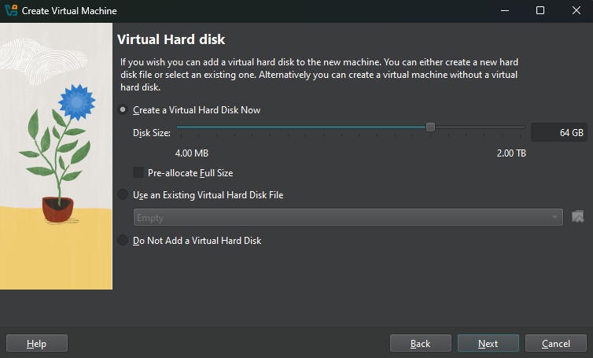

    **Note:** By default, the 64 GB of storage is not pre-allocated.

5. The summary will show the recommended hardware settings, except for one which must be configured manually, then click on `Customize Hardware...`

    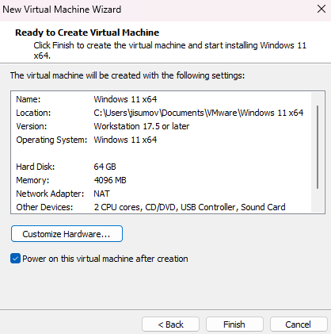

    The network adapter is set as `NAT` to share the host's internet connection, and so it will eventually require a Windows Account. Therefore, select `Host-only`, which will be helpful to bypass the remaining setup.

    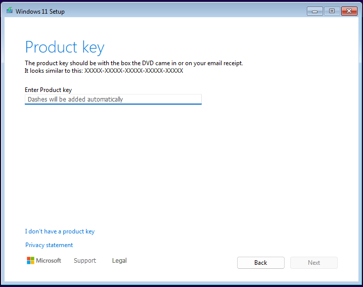

6. Finish the machine creation and click on `Power on this virtual machine`.

7. During the configuration process, make sure to select `I don't have a product key`.

    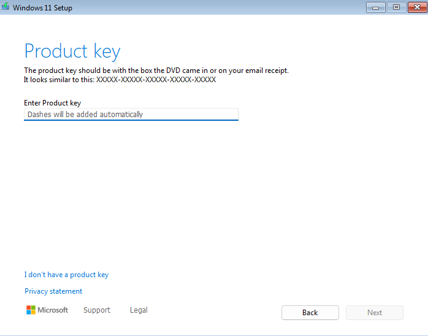

    In addition, select Windows 11 Pro, because of the `RDP` feature explained here: [https://learn.microsoft.com/en-us/windows-server/remote/remote-desktop-services/clients/remote-desktop-supported-config](https://learn.microsoft.com/en-us/windows-server/remote/remote-desktop-services/clients/remote-desktop-supported-config).

    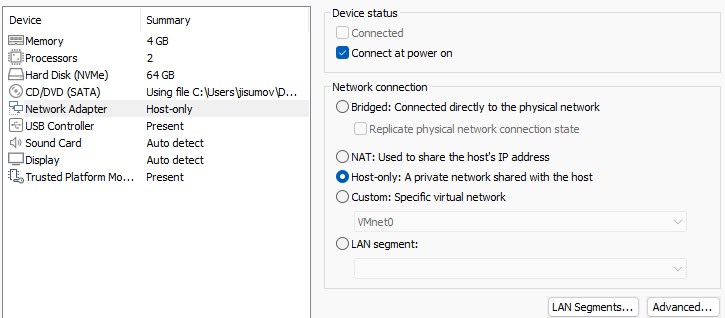

8. During the setup, it will ask to connect to a network. To bypass this step, do `Shift+F10` to open the `CMD` and execute the following command:

    ```bash
    oobe\bypassnro
    ```

    It will restart the machine and enable the `I don't have internet` option, select it and finish the setup.

    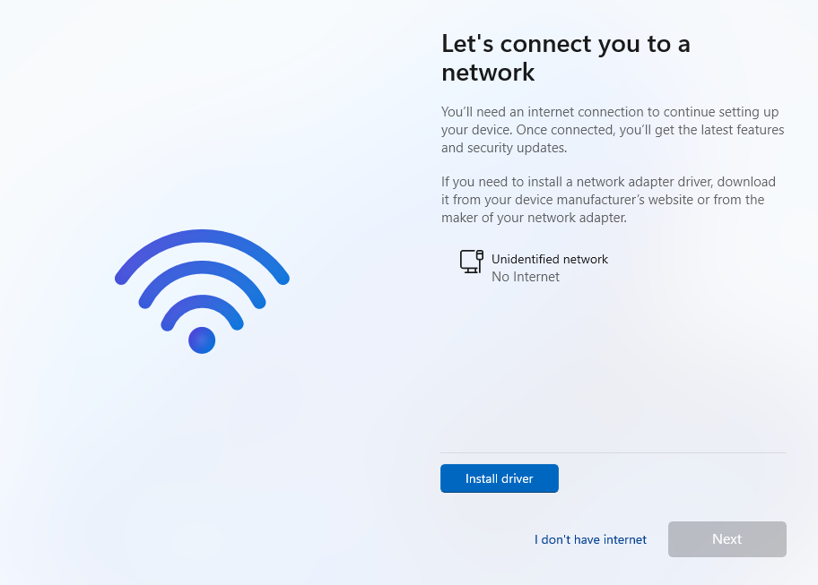

9. After the Windows setup, ensure a smoother virtualization experience by going to the `VM` tab and select `Install VMware Tools`.

    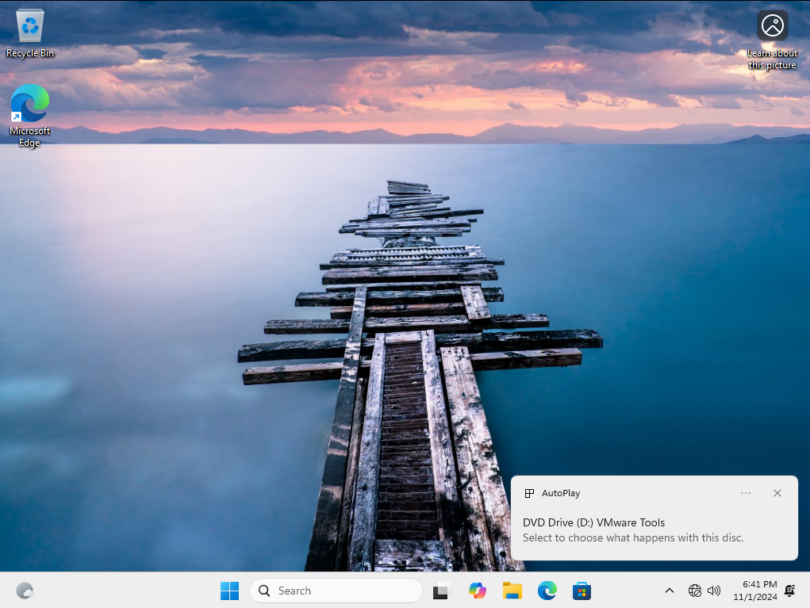

    It will load the drive and ask to execute the `Run setup64.exe`, click on it and follow the default options.

    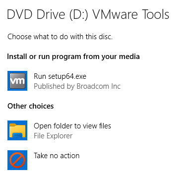

10. To have internet in the VM, go to the left bar, right click on the machine name and select `Settings...`

    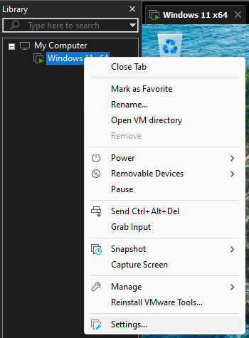

    And, in the `Network Adapter` section choose `NAT` to ensure the VM is not alongside the host network, but has its own through the host `IP`.

    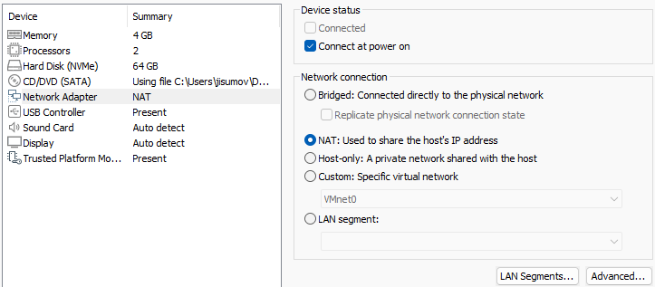

11. Finally, for future recovery of the fresh install, go to the `VM` tab, then click on `Snapshot` and `Take Snapshot...`

    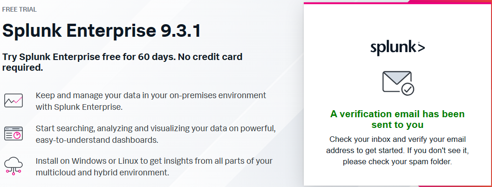

    Assign a name like "Fresh Install" and click `Take Snapshot`

    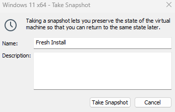

## Splunk Setup
Splunk is a SIEM to search, monitor and analyze machines' data. This tool will be working on the Windows VM.

1. In the local machine go to: [https://www.splunk.com/en_us/download/splunk-enterprise.html](https://www.splunk.com/en_us/download/splunk-enterprise.html). It requires an account to try the tool for 60 days.
    
    In this case, use a temporary email with: [https://temp-mail.org/](https://temp-mail.org/), which will serve as a workaround everytime Splunk is tested out, and activate the account.

    

2. Now, click on `Download Now` to get the Splunk installer.

    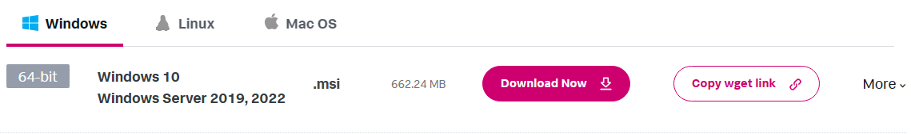

    Also, the integrity of the executable can be checked in the same way as the third step of the VMware Setup. Retrieve the hash by clicking on `More` and then on `Download SHA512 to verify your bits`.

    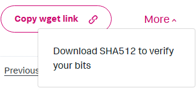

    It will download a file which can be opened with Notepad, and since the hash algorithm is SHA512, specify that in the PowerShell as follows:

    ```bash
    Get-FileHash <file-name> -Algorithm SHA512
    ```

    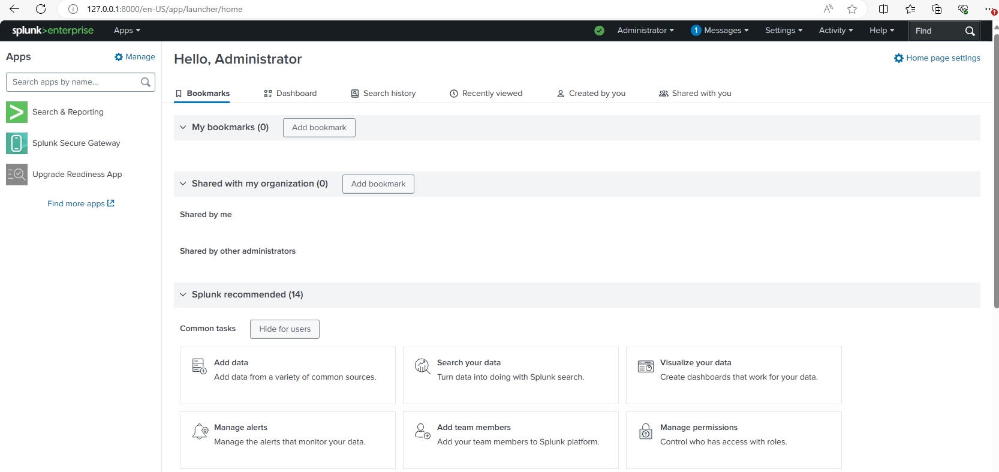

3. Execute the Splunk installer and follow the default settings. It will setup Splunk in a `Local System Account`, which is the Windows VM. 

    In case, Splunk needs to oversee data across multiple machines within an Active Directory domain, change to `Domain Account`.

    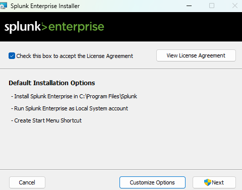

4. Splunk is now installed and running on `http://127.0.0.1:8000/`

    

## Sysmon Setup
Sysmon is a service that monitors and logs system activity. This tool will be working on the Windows VM.

1. In the local machine, go to: [https://learn.microsoft.com/en-us/sysinternals/downloads/sysmon](https://learn.microsoft.com/en-us/sysinternals/downloads/sysmon). Then, click on `Download Sysmon`

    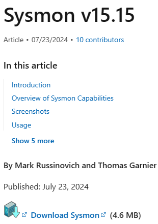

2. Sysmon can be installed with a configuration file. The one used for future reference is found at: [https://raw.githubusercontent.com/olafhartong/sysmon-modular/refs/heads/master/sysmonconfig.xml](https://raw.githubusercontent.com/olafhartong/sysmon-modular/refs/heads/master/sysmonconfig.xml). Right click and select `Save as`, then keep it on a memorable location.

    

3. Open the `Downloads` folder and extract the `Sysmon.zip` as follows:

    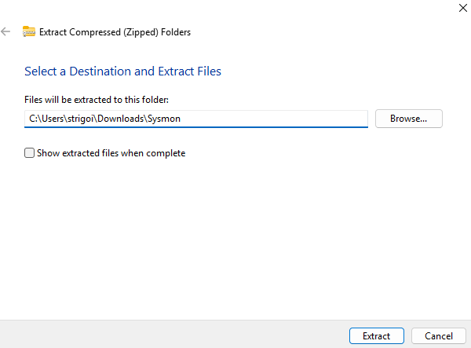

    Then, drag and drop the `sysmonconfig.xml` into the generated `sysmon` folder. The content should look like this:

    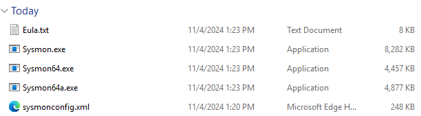

4. Open a PowerShell as an administrator within the same folder location and execute the following command to install Sysmon with the configuration file:

    ```bash
    .\Sysmon64.exe -i .\sysmonconfig.xml
    ```

    

    Then, proceed with the default installation process.

5. To check if Sysmon is up and running, press the Windows button to search `Services`, open it and then look for `Sysmon64`.

    

    Also, at the `Event Viewer`, Sysmon can be found via `Applications and Services Logs` -> `Microsoft` -> `Windows` -> `Sysmon`.

    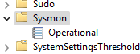

## Kali Linux Setup
Kali Linux is a Debian-based Linux distribution which is commonly used for penetration testing. Since this scenario is more focused on defense, the VM will be taken from a pre-built configuration.

1. Download the Kali Linux pre-built VM found at: [https://www.kali.org/get-kali/#kali-virtual-machines](https://www.kali.org/get-kali/#kali-virtual-machines).

    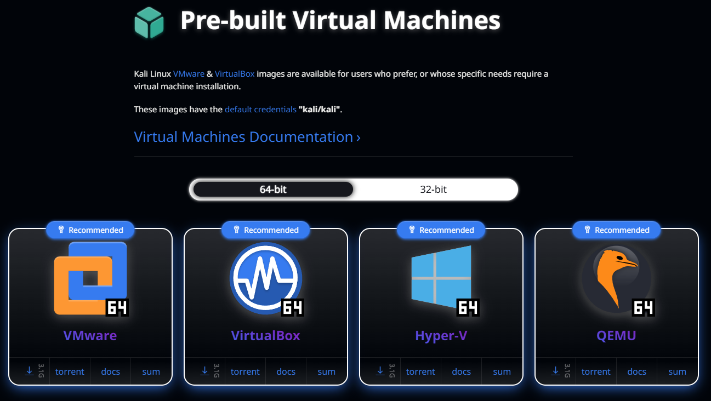

2. Then, extract the `.7z` into the VMWare folder that hosts all the VMs.

    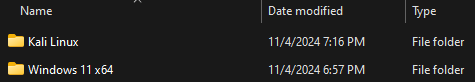

3. Before powering up the VM, ensure that it is compatible with the actual VMware version. Therefore, click on the VM, and then on `Upgrade this virtual machine`.

    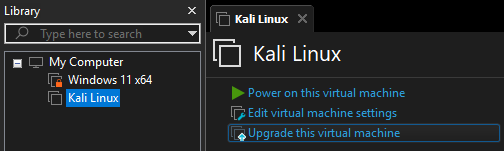

4. In this case, the hardware compatibility must align with the VMware `Workstation 17.5 or later` version, let the default configuration and click on next.

    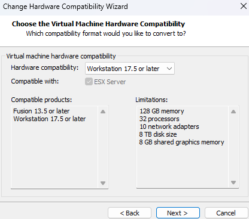

5. Select `Alter this virtual machine`, so the resources usage is optimized, as it is not creating a new VM for this particular use case.

    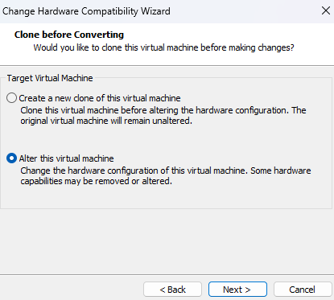

6. Review the changes and click on `Finish`.

    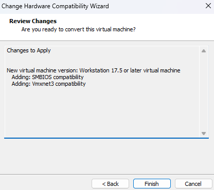

7. Power on the VM and login with the default credentials `kali/kali`.

    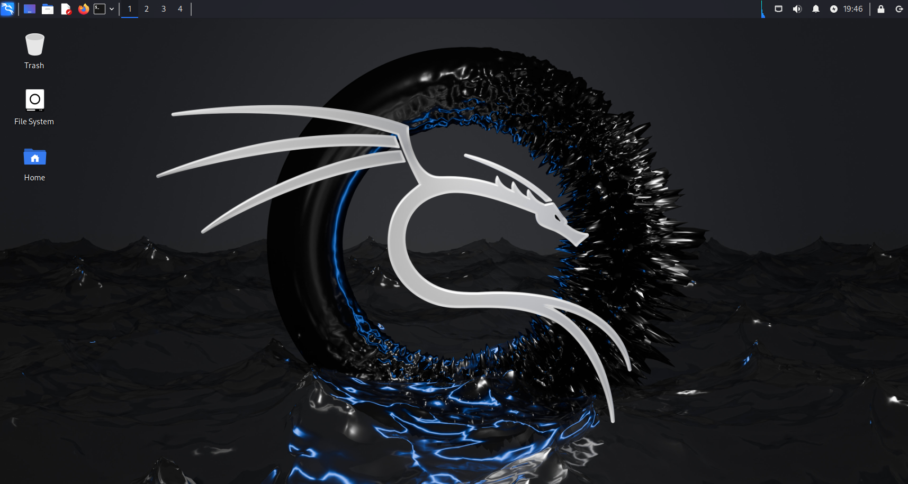

## Network Configuration
In order to avoid any VM escaping, the network must be segmented and isolated from the exterior, so the involved machines in this educational attack/defense scenario can communicate between them and not outside of the environment.

1. Go to any VM Settings, then on Network Adapter find the option `LAN Segments...`
    
    This is where the `Test` LAN segment should be added.

    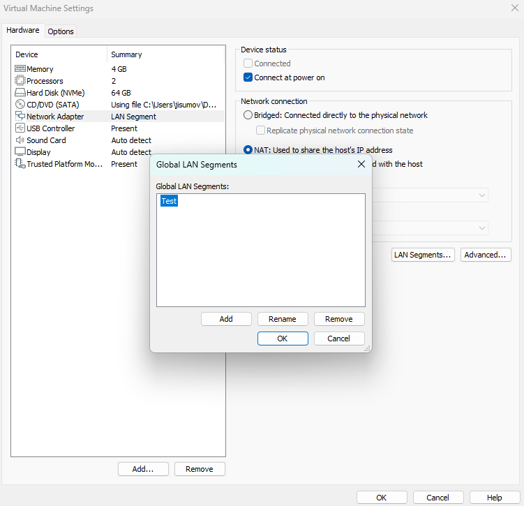

    The new `Test` LAN segment should be selected, instead of any other network connection.

    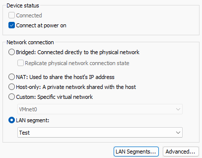

2. The following are the steps for the Windows Host network setup:

    2.1. Right click on the Internet icon and select `Network and Internet settings`.

    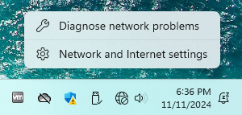

    2.2. Then, click on `Advanced network settings`.

    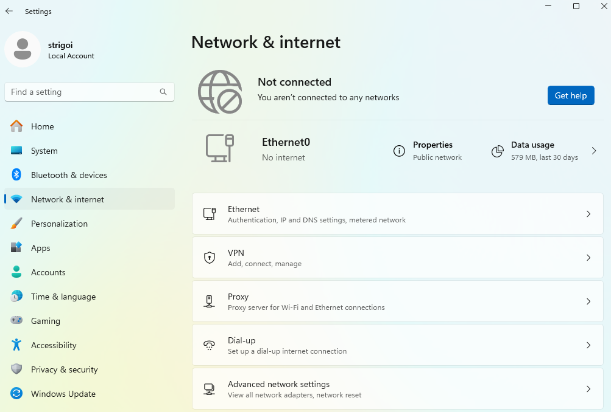

    2.3. Now, click on the accordion called `Ethernet0` and then on the edit button of `More adapter options`.

    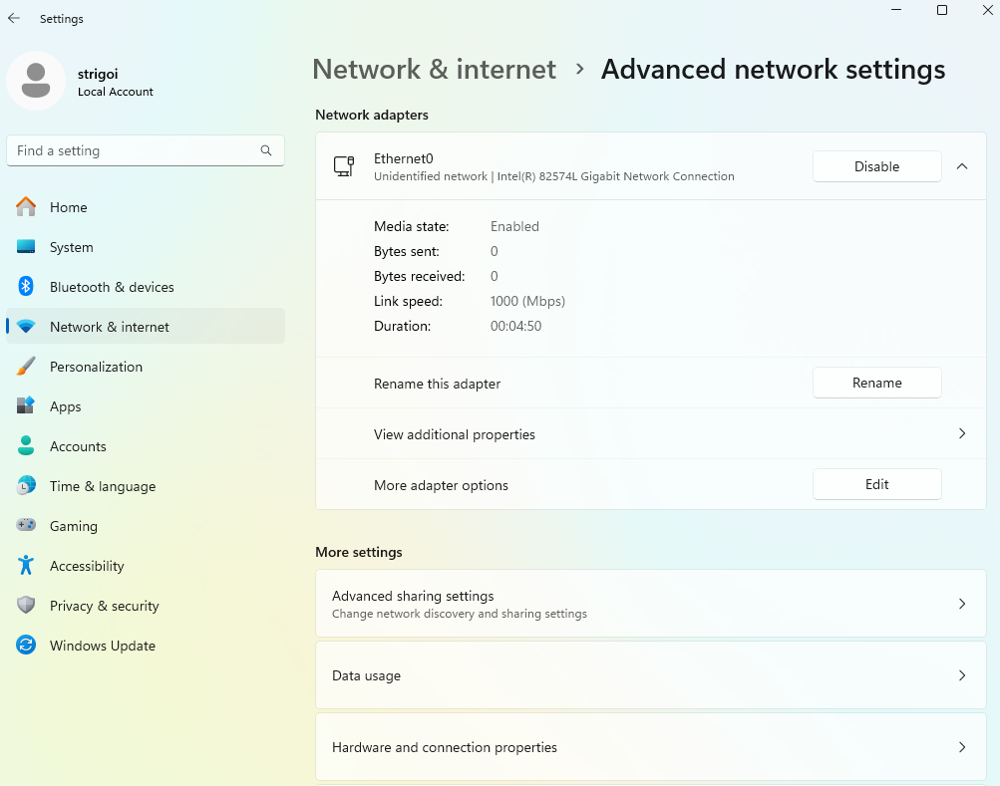

    2.4. Find `Internet Protocol Version 4 (TCP/IPv4)` and double click it.

    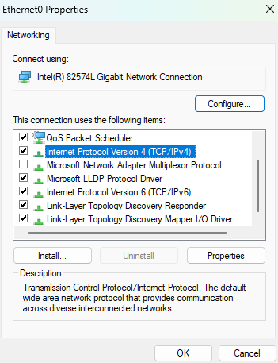

    2.5. Below the section `Use the following IP address`, establish an IPv4 address. 
    
    In this case, the IP address `10.0.0.1` mimics the way workloads might be setup in any cloud provider, as it is a class A within the private IP range.

    The number of hosts is limited by the subnet mask, that is `255.255.255.252`. Consequently, a total of 2 hosts is allowed for this lab.

    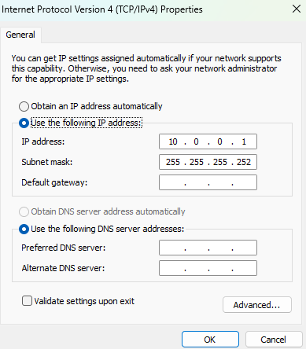

    2.6. Save the changes and open a CMD, where the command `ipconfig` is executed to display the network layout. It should contain the recently saved configuration.

    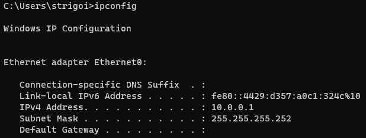