# The Logs Aren't Alright

## Description

A new social media star arises, fans asking personal questions, sponsor emails raining like crazy... The case `CloutHaus: Social Media leads to Compromise` teaches security awareness going beyond corp boundaries.

{: .popup-img }

**Note:** The scope of this write-up will be explaining the KQL queries used to solve the exercise questions. If you wanna enjoy the full story, go check [KC7 Game](https://kc7cyber.com), it's free.

## Tasks

1. **According to CloutHaus internal employee logs, what is Afomiya’s designated professional email?**

	The table _Employees_ includes all the personnel information. Here we may look for Afomiya's email.

	<span class="alternative-label">This query will solve questions 1 to 3:</span>

	```sql
   Employees
   | where name contains "afomiya"
	```
	- `Employees` sets the table to be looked at, which optimizes the searching performance.

	- `where` shows results based on satisfied conditions to extract the relevant logs from noise.

	- `name` is the field that the query is interested in, do please note that it is case-sensitive.
	
	- `contains` searches for strings containing the provided characters, for example the records may include _afomiya123_ or _xyzafomiya_.

	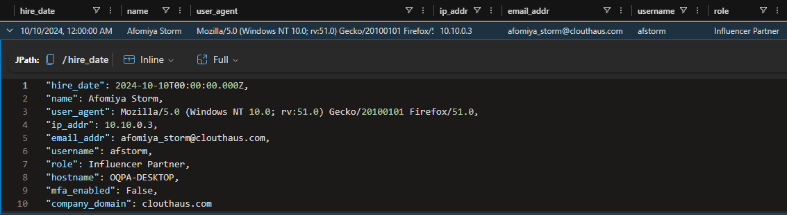{: .popup-img }

	So, Afomiya's designated professional email can be found at the field **email_addr**.

	<span class="alternative-label">Answer:</span> `afomiya_storm@clouthaus[.]com`

2. **What is Afomiya’s role with CloutHaus?**

	The role of Afomiya is within the field **role**.

	<span class="alternative-label">Answer:</span> `Influencer Partner`

3. **Based on the CloutHaus employee table, what is the status of Multi-Factor Authentication (MFA) for Afomiya’s account?**

	Look at the **mfa_enabled** field, bad practice but it is what it is.

	<span class="alternative-label">Answer:</span> `False`

4. **What is the sender’s email address in the email Afomiya received from "Dior"?**

	Now, we're looking through the _Email_ table, then use the recipient email and do a general search with the keyword _dior_.

	<span class="alternative-label">This query will solve questions 4 to 6:</span>

	```sql
   Email
   | where recipient == "afomiya_storm@clouthaus.com"
   | where subject contains "dior" or links contains "dior"
	```

	- `==` is the equal operator, which must match every character of the provided string.

	- `or` unites two conditions, if one of them are satisfied, then it returns the matched row.

	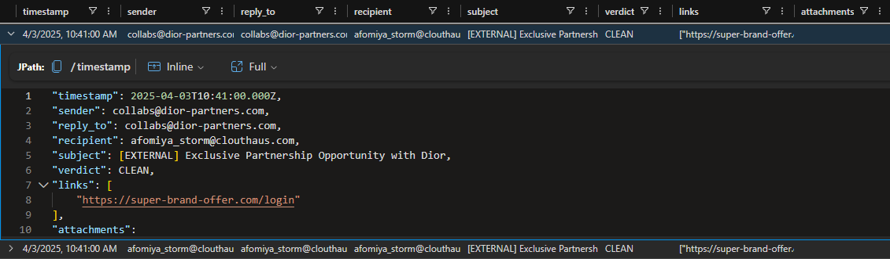{: .popup-img }

	Then, the sender email is found at the **sender** field.
	
	<span class="alternative-label">Answer:</span> `collabs@dior-partners[.]com`

5. **What is the subject line of the email Afomiya received from "Dior"?**

	Search for the field **subject** and you got it.
	
	<span class="alternative-label">Answer:</span> `[EXTERNAL] Exclusive Partnership Opportunity with Dior`

6. **What is the link provided in the email?**

	Look at the list field called **links**.
	
	<span class="alternative-label">Answer:</span> `hxxps[:]//super-brand-offer[.]com/login`

7. **When did Afomiya click on the link? Paste the entire timestamp.**

	The _OutboundNetworkEvents_ table records whenever a user visits a website, let's write it down.

	<span class="alternative-label">This query will solve questions 7 to 8:</span>

	```sql
   OutboundNetworkEvents
   | where url contains "https://super-brand-offer.com/login"
	```

	This is the first time Afomiya clicked the URL:

	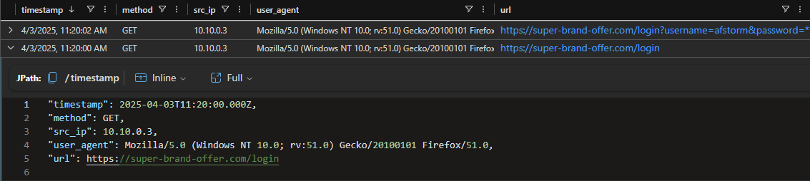{: .popup-img }

	And this is the login attempt performed by Afomiya:

	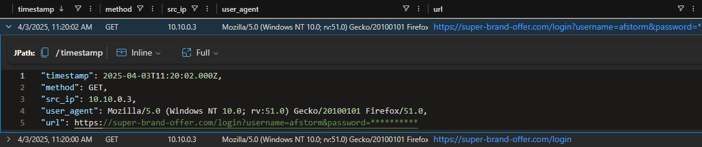{: .popup-img }

	So, better take the first generated event's **timestamp**.
	
	<span class="alternative-label">Answer:</span> `2025-04-03T11:20:00.000Z`

8. **What username did she enter?**
	
	Within the **url** value there is a parameter called **username**.

	<span class="alternative-label">Answer:</span> `afstorm`

9. **What is the IP address associated with the domain?**
	
	Every IP could have an associated domain, that's when _PassiveDNS_ table comes into play.

    ```sql
   PassiveDns
   | where domain contains "super-brand-offer.com"
    ```

	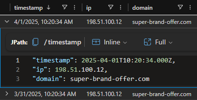{: .popup-img }

	Check the **ip** field.

	<span class="alternative-label">Answer:</span> `198[.]51[.]100[.]12`

10. **How many distinct domains are linked to the suspicious IP address?**
	
	The previous query may be updated to search all the domains that have shared the same IP address.

	```sql
	PassiveDns
	| where ip == "198.51.100.12"
	| distinct domain
	```

	- `distinct` serves to display just one entry for each match, for example if there are three rows with the same domain, then the results will show that domain once.

	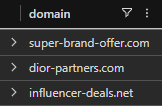{: .popup-img }

	Then, the count sums 3 different domains.

	<span class="alternative-label">Answer:</span> `3`

11. **What IP address was used to gain access?**
	
	The _AuthenticationEvents_ table may provide the information related to account access attempts.

	<span class="alternative-label">This query will solve questions 11 and 13:</span>

	```sql
	AuthenticationEvents
	| where username == "afstorm"
	```

	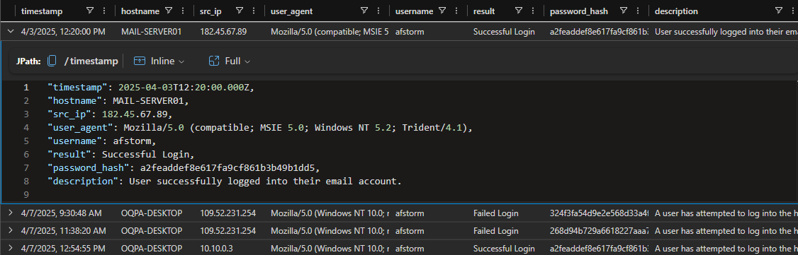{: .popup-img }

	Here, the question focuses on Afomiya's email, then correlate the **MAIL-SERVER01** with the **src_ip**.

	<span class="alternative-label">Answer:</span> `182[.]45[.]67[.]89`

12. **What domains are associated with this IP? (enter one)**
	
	Let's use the reliable _PassiveDNS_ table for this question.

	```sql
	PassiveDns
	| where ip == "182.45.67.89"
	| distinct domain
	```

	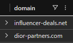{: .popup-img }

	So, just provide one of the two domains.

	<span class="alternative-label">Answer:</span> `influencer-deals[.]net`

13. **What part of the User-Agent string indicates the suspicious browser and operating system? (Submit either the browser name/version or the operating system name/version.)**
	
	Look at the question 11 results, there is a field called **user_agent**

	<span class="alternative-label">Answer:</span> `Mozilla/5.0 (compatible; MSIE 5.0; Windows NT 5.2; Trident/4.1)`

14. **What country did the login originate from?**
	
	Here, KC7 recommends the tool [MaxMind](https://www.maxmind.com/en/geoip-demo) to look for the IP Geolocation.

	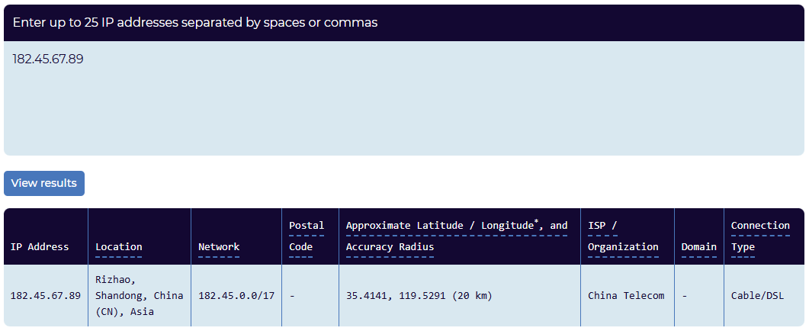{: .popup-img }

	In this case, just put the country that resides in the **Location** field.

	<span class="alternative-label">Answer:</span> `China`

15. **According to the attacker's web search history on the site, what were they trying to hack?**
	
	Let's check the _OutboundNetworkEvents_ activity from the ip _182[.]45[.]67[.]89_.

	```sql
	InboundNetworkEvents
	| where src_ip == "182.45.67.89"
	```

	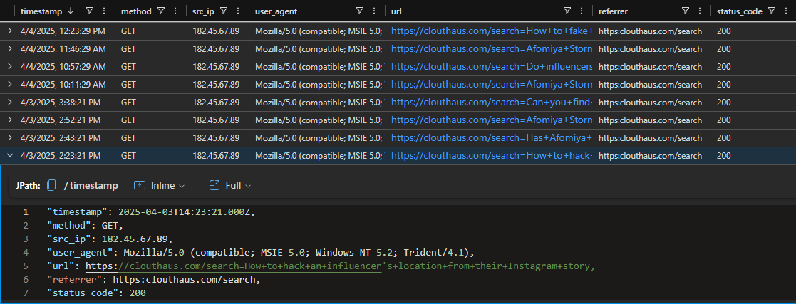{: .popup-img }

	Looking through the **url** records, one stands out for containing the keyword **hack** and so the target.

	<span class="alternative-label">Answer:</span> `Location`

16. **According to another search log, what kind of personal info were they sneakily trying to uncover (and pretending to ask “for a friend”)?**
	
	Let's check the _OutboundNetworkEvents_ activity from the ip _182[.]45[.]67[.]89_, with an extra filter to not get overwhelmed by the previous logs.

	```sql
	InboundNetworkEvents
	| where src_ip == "182.45.67.89"
	| where url has "friend"
	```

	- `has` hunts for a complete case-insensitive string, for example _best friend_ has _friend_ or _fRiEnD_.

	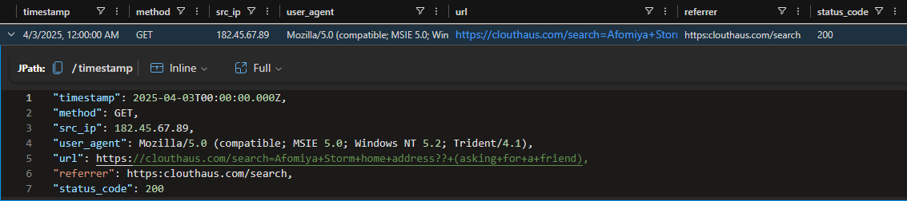{: .popup-img }

	Then, the threat actor was looking for Afomiya's residence.

	<span class="alternative-label">Answer:</span> `Home Address`

17. **What kind of account or app does that log suggest they were targeting?** _(Note: It's about money)_.
	
	So, if money is involved, we may build up a list of possible keywords to get to the roots in the _OutboundNetworkEvents_ logs.

	```sql
	let keywords = dynamic(["payment", "transaction", "history"]);
	InboundNetworkEvents
	| where src_ip == "182.45.67.89"
	| where url has_any (keywords)
	```

	- `let` creates a variable, which might be an expression or a function, helpful to organize our thoughts before hand.
	- `dynamic` setups the 
	- `;` do not skip it, as it closes the sentence to proceed with the next instruction.

	{: .popup-img }

	Then, the threat actor was looking for Afomiya's residence.

	<span class="alternative-label">Answer:</span> `Home Address`

## Raw Results

This is a space for saving the query results in text format, useful whenever a value is needed.

### Employees

```bash
"hire_date": 2024-10-10T00:00:00.000Z,
"name": Afomiya Storm,
"user_agent": Mozilla/5.0 (Windows NT 10.0; rv:51.0) Gecko/20100101 Firefox/51.0,
"ip_addr": 10.10.0.3,
"email_addr": afomiya_storm@clouthaus.com,
"username": afstorm,
"role": Influencer Partner,
"hostname": OQPA-DESKTOP,
"mfa_enabled": False,
"company_domain": clouthaus.com
```

### Email

```bash
"timestamp": 2025-04-03T10:41:00.000Z,
"sender": collabs@dior-partners.com,
"reply_to": collabs@dior-partners.com,
"recipient": afomiya_storm@clouthaus.com,
"subject": [EXTERNAL] Exclusive Partnership Opportunity with Dior,
"verdict": CLEAN,
"links": [
	"https://super-brand-offer.com/login"
],
"attachments": 
```

### OutboundNetworkEvents

```bash
"timestamp": 2025-04-03T11:20:00.000Z,
"method": GET,
"src_ip": 10.10.0.3,
"user_agent": Mozilla/5.0 (Windows NT 10.0; rv:51.0) Gecko/20100101 Firefox/51.0,
"url": https://super-brand-offer.com/login
```

```bash
"timestamp": 2025-04-03T11:20:02.000Z,
"method": GET,
"src_ip": 10.10.0.3,
"user_agent": Mozilla/5.0 (Windows NT 10.0; rv:51.0) Gecko/20100101 Firefox/51.0,
"url": https://super-brand-offer.com/login?username=afstorm&password=**********
```

```bash
"timestamp": 2025-04-03T14:23:21.000Z,
"method": GET,
"src_ip": 182.45.67.89,
"user_agent": Mozilla/5.0 (compatible; MSIE 5.0; Windows NT 5.2; Trident/4.1),
"url": https://clouthaus.com/search=How+to+hack+an+influencer’s+location+from+their+Instagram+story,
"referrer": https:clouthaus.com/search,
"status_code": 200
```

### PassiveDNS

```bash
"timestamp": 2025-03-31T10:20:34.000Z,
"ip": 198.51.100.12,
"domain": super-brand-offer.com
```

```bash
"timestamp": 2025-04-01T10:20:34.000Z,
"ip": 198.51.100.12,
"domain": super-brand-offer.com
```

```bash
super-brand-offer.com
dior-partners.com
influencer-deals.net
```

### AuthenticationEvents

```bash
"timestamp": 2025-04-03T12:20:00.000Z,
"hostname": MAIL-SERVER01,
"src_ip": 182.45.67.89,
"user_agent": Mozilla/5.0 (compatible; MSIE 5.0; Windows NT 5.2; Trident/4.1),
"username": afstorm,
"result": Successful Login,
"password_hash": a2feaddef8e617fa9cf861b3b49b1dd5,
"description": User successfully logged into their email account.
```

## Cheat Sheet

- `where` shows results based on satisfied conditions to extract the relevant logs from noise.

- `name` is the field that the query is interested in, do please note that it is case-sensitive.
	
- `contains` searches for strings containing the provided characters, for example if the keyword is "afomiya", then the records may include _afomiya123_ or _xyzafomiya_.

- `==` is the equal operator, which must match every character of the provided string.

- `or` unites two conditions, if one of them are satisfied, then it returns the matched row.

- `distinct` serves to display just one entry for each match, for example if there are three rows with the same domain, then the results will show that domain once.

- `has` hunts for a complete case-insensitive string, for example _best friend_ has _friend_ or _fRiEnD_.